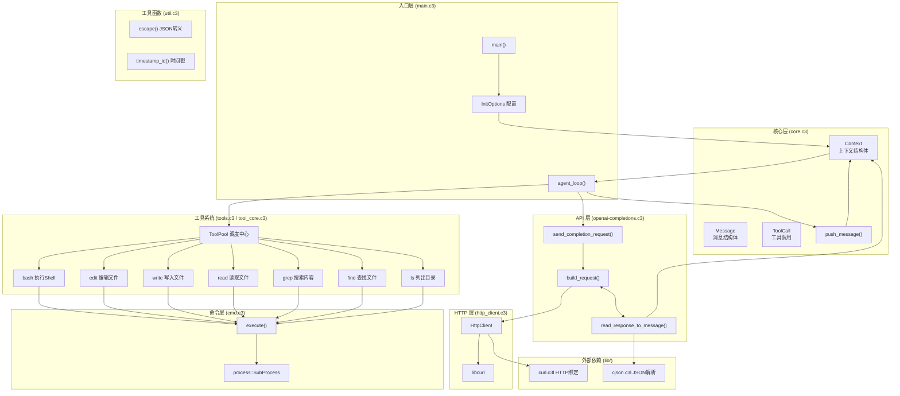

# mini-pi (mp)

## 架构图



## 模块说明

| 模块 | 文件 | 职责 |
|------|------|------|
| **入口层** | `main.c3` | 程序入口、Agent 主循环 |
| **核心层** | `core.c3` | Context/Message 等核心数据结构 |
| **API 层** | `openai-completions.c3` | OpenAI Completions API 集成 |
| **HTTP 层** | `http.c3` | HTTP 客户端封装 |
| **工具系统** | `tools.c3` | 7 个内置工具及调度中心 |
| **命令层** | `cmd.c3` | 外部进程执行 |
| **工具函数** | `util.c3` | JSON 转义、时间戳等 |

这个 coding agent 是我在学习 Ralph loop 时的一个想法。

Ralph loop 号称 All you need is bash，本身是通过 Loop 让 coding agent 不断完成任务。我认为 plan-with-files 等等都可以认为是 Ralph loop 的一种变形。我原计划是实现一个简单的 js 脚本用于实现我自己的 Ralph loop。但是我发现在执行过程会缺少审计日志，无法知晓当前进度，这是一个痛点。

我也使用过比如 OpenCode 内部集成的 Ralph loop，但是本质是一个 Coding agent 进程完成各个任务。这样就容易出现 80G 内存的占用。

我的解法是自制软件。基于 pi-coding-agent 也是一个好想法，不过我更倾向自己开发。pi 有很多拓展功能，明显我是不需要的。因此我参考 pi 的设计，开发这个 coding agent。

## TODOs

- [x] Agent loop
  - [x] 支持 OpenAI Completions API (Text only)
  - [x] 多轮交互
  - [x] 支持调用工具
- [x] 工具
  - [x] read
  - [x] ls
  - [x] grep
  - [x] find
  - [x] edit
  - [x] write
  - [x] bash
- [ ] 第一次重构
  - [x] 分层 ui-loop-request
  - [x] 集成 libcurl
  - [ ] 集成 cjson
- [ ] 命令行参数支持 
- [ ] 多 agent 支持
- [ ] 支持 Ralph loop
- [ ] skills 支持
- [ ] 审计日志


## 更新 libcurl-x64.dll

curl 官方的 windows 版本只提供了 mingw-w64 的 .a 文件，没有 msvc 编译需要的 .lib，可以从 .def 文件生成 .lib：

> 需要 msvc，可以使用 [portable-msvc.py](https://gist.github.com/mmozeiko/7f3162ec2988e81e56d5c4e22cde9977) 安装便携版。

设置 msvc prompt 里执行：

```cmd
lib.exe /def:libcurl-x64.def /out:lib/curl.c3l\windows-x64\libcurl.lib /machine:x64
```

## LICENSE

MIT
