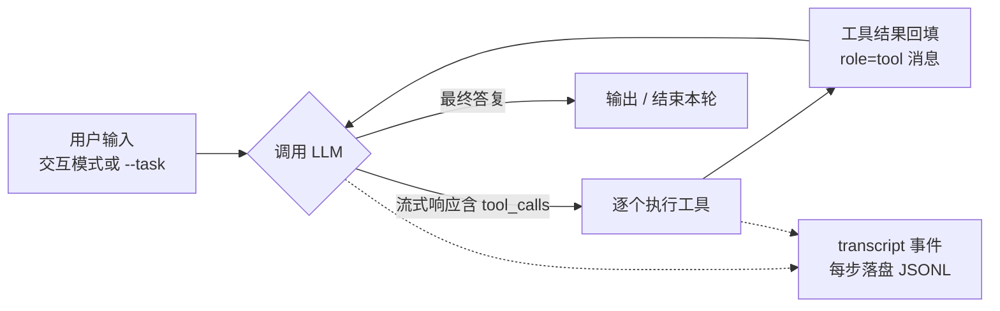

# mp

**my own coding agent, inspired by Pi** — 用 [C3 语言](https://c3-lang.org) 写成的命令行编码智能体。

`mp` 通过 OpenAI 兼容的 Chat Completions API（流式 SSE）与任意大模型交互，内置一套面向编码场景的工具（读文件、哈希锚点编辑、搜索、执行命令、递归子 agent），支持交互式多轮对话与非交互式批处理，并默认把每个会话完整记录为可审计、可恢复的 transcript。

原生、轻量（单个 exe + libcurl 动态库）、默认无任何外部框架依赖。

## 特性

- **Agent Loop**：思考链（reasoning）+ 多轮对话 + 单次回复多工具调用
  - OpenAI Chat Completions 兼容（流式 SSE），`reasoning` / `reasoning_content` 均可识别
  - 工具调用逐个执行，结果回填后继续请求模型，直到模型给出最终答复
- **哈希锚点编辑（HashEditFile）**：核心特色
  - `ReadFile` 输出的每行都带 `line:hash|content` 锚点标签
  - 编辑时只需引用「行号 + 哈希」，无需复述整段旧文本
  - **批量原子提交**：写入前校验全部锚点，任一过期（文件已被改动）即整体拒绝，绝不半改
  - 支持单行替换 / 区间替换 / 插入 / 删除四种操作
- **会话记录与恢复（transcript）**
  - 每个会话自动落盘一份 JSONL 记录：`<config_dir>/transcripts/<session_id>.jsonl`
  - 记录用户消息、模型回复（含思考链）、每次工具调用的输入输出、token 用量与延迟
  - `mp --resume <session_id>` 断点续跑，中断/崩溃不丢失上下文；敏感场景可用 `--no-transcript` 关闭
- **内置工具**（可按 `--tools` 裁剪）

  | 工具 | 说明 |
  | --- | --- |
  | `ReadFile` | 读取文件，输出 `line:hash|content` 锚点格式，支持 `offset`/`limit` 分页 |
  | `HashEditFile` | 基于行哈希锚点的精确编辑，批量原子提交（推荐首选） |
  | `WriteFile` | 写入/创建文件，自动创建父目录 |
  | `Bash` | 执行 shell 命令（`sh -c`），超 2000 行自动截断并保存完整输出 |
  | `Grep` | 基于 [ripgrep](https://github.com/BurntSushi/ripgrep) 的内容搜索 |
  | `Glob` | 基于 [fd](https://github.com/sharkdp/fd) 的文件名搜索 |
  | `ListDir` | 列出目录（纯 C3 实现，目录优先排序 + 扩展名统计） |
  | `Task` | 以子进程启动子 agent 执行子任务（递归调用 `mp` 自身） |
- **Skill 支持**：从 `~/.agents/skills/`（全局）与 `.agents/skills/`（项目）加载 `SKILL.md`
- **项目上下文**：自动注入当前目录的 `AGENTS.md`
- 分级日志（debug/info/warn/error）、`--debug` 转储 HTTP 请求/响应、`NO_COLOR` 支持

## 工作流程


```mermaid
flowchart LR
    A[用户输入<br/>交互模式或 --task] --> B{调用 LLM}
    B -->|流式响应含 tool_calls| C[逐个执行工具]
    C --> D[工具结果回填<br/>role=tool 消息]
    D --> B
    B -->|最终答复| E[输出 / 结束本轮]
    B -.-> T[transcript 事件<br/>每步落盘 JSONL]
    C -.-> T
```

每个会话的全部推理、工具调用与 token 消耗都会按事件顺序写入 transcript，可随时用 `--resume` 恢复或离线审计。

## 快速开始

### 环境要求

- 最新版 [c3c 编译器](https://github.com/c3lang/c3c/releases/latest)（仅构建时需要）
- 运行时：同目录下的 `libcurl-x64.dll`（Windows），以及系统中的 `rg`、`fd`、`sh`

### 构建

```sh
# 开发构建
c3c build

# 发布构建（等价于 c3c build --trust=full -O2 -D RELEASE）
sh scripts/release.sh
```

产物为 `build/mp`（Windows 下 `build/mp.exe`）。

### 配置 LLM

默认连本地的 OpenAI 兼容端点，用命令行参数覆盖即可：

```bash
mp --model deepseek-reasoner --base-url https://api.deepseek.com --api-key <你的key>
```

- `--base-url`：API base URL，实际请求 `<base-url>/chat/completions`
- `--model`：模型 ID（如 `deepseek-reasoner`、`gpt-4o`）
- `--api-key`：API Key，以 `Authorization: Bearer <key>` 发送

### 运行

```bash
# 交互模式（默认）
mp

# 一次性任务（headless）
mp --headless --task "请帮我创建一个 hello world 程序"

# 任务从文件读取，结果写入文件
mp --headless --task-file prompt.txt --output-file result.txt

# 断点续跑：恢复上一次中断的会话
mp --resume ses_20260804_153242

# 限制可用工具
mp --tools ReadFile,Grep,Glob
```

## 交互式命令

交互模式下内置以下命令（不经过 LLM）：

| 命令 | 说明 |
| --- | --- |
| `/export` | 将当前对话导出为 Markdown（`<session_id>.md`） |
| `/clear` | 清空历史，开启新会话（旧会话 transcript 收尾保存） |
| `/exit`, `/e` | 退出会话，并显示当前 Session ID |

## 命令行参数

| 参数 | 说明 | 默认值 |
| --- | --- | --- |
| `--config, -c <path>` | 配置目录 | `~/.config/mp/` |
| `--agent <name>` | 智能体角色 | `default` |
| `--model <id>` | 模型 ID | `Any` |
| `--base-url <url>` | OpenAI 兼容 API base URL | `http://127.0.0.1:5678` |
| `--api-key <key>` | API Key | `sk-1234` |
| `--tools <list>` | 允许的工具列表（逗号分隔） | `ReadFile,Bash,HashEditFile,WriteFile,Grep,Glob,ListDir,Task` |
| `--headless` | 非交互模式，一轮后自动退出 | 交互模式 |
| `--task, -t <msg>` | 初始任务 | - |
| `--task-file, -f <path>` | 从文件读初始任务 | - |
| `--output-file, -o <path>` | 最后一次 LLM 回复写入文件 | - |
| `--resume <session_id>` | 从 transcript 恢复会话 | - |
| `--no-transcript` | 关闭本会话 transcript 写入 | 开启 |
| `--list-skills` | 列出全部可用 skill | - |
| `--debug` | DEBUG 模式，转储 HTTP 请求/响应到 `logs/` | - |
| `--help, -h` / `--version, -v` | 帮助 / 版本 | - |

完整说明见 [docs/flags.md](docs/flags.md)。

## 会话记录（transcript）

每次会话默认写一份结构化记录：`<config_dir>/transcripts/<session_id>.jsonl`，JSONL 每行一个事件，发生即落盘（崩溃安全）：

- **7 类事件**：`session_start` / `user_message` / `assistant_message` / `tool_result` / `api_usage` / `system_event` / `session_end`
- **可审计**：token 消耗（prompt/completion/reasoning 分开统计）、每次 API 延迟、模型 ID、每个工具调用「模型当时看到」的输入输出
- **可恢复**：`session_start` 快照完整 system prompt，`--resume <session_id>` 原样回放历史，自动丢弃中断的尾巴轮次
- **关闭**：`--no-transcript`

格式规范见 [docs/transcript.md](docs/transcript.md)。

## Skill

把 `SKILL.md`（带 YAML frontmatter）放进 `~/.agents/skills/<name>/`（全局）或 `.agents/skills/<name>/`（项目）即可：

```markdown
---
name: my-skill
description: 在什么场景使用这个 skill
---
正文指令…
```

`mp` 启动时自动加载，并把已安装 skill 的名称、描述、路径以 XML 形式注入系统提示词。

## 目录结构

```sh
src/            # 源码
  context/      # 核心数据结构与系统提示词装配
  api/          # LLM API 客户端（流式 SSE）
  tool/         # 工具系统（8 个工具 + JSON Schema）
  util/         # 工具函数（哈希、子进程、Markdown 解析等）
test/           # 单元测试（c3c test）
resources/      # 预设 agent 定义、内置 skill
lib/            # cjson.c3l、curl.c3l
docs/           # 文档
```

## 文档

- [架构设计（面向开发）](docs/arch.md)
- [命令行参数](docs/flags.md)
- [配置目录](docs/config.md)
- [Transcript 记录格式规范](docs/transcript.md)
- [更新 libcurl](docs/update-libcurl.md)
- [C3 语言简介](docs/c3-intro.md)

## License

MIT
