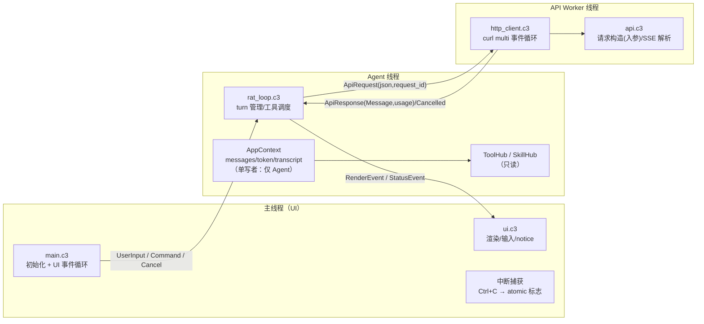
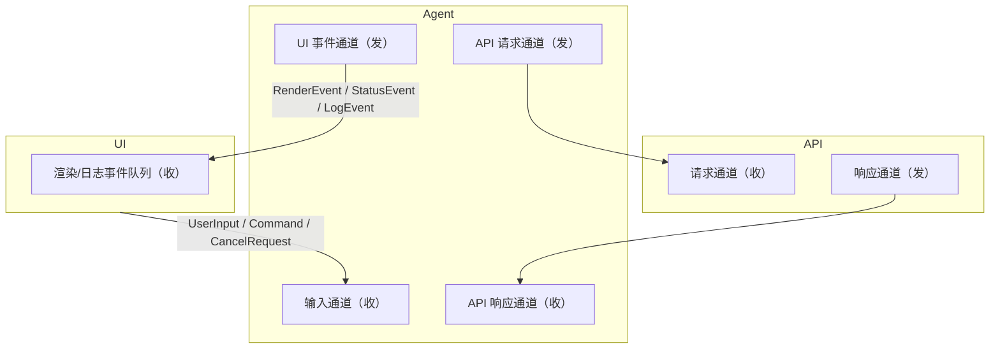
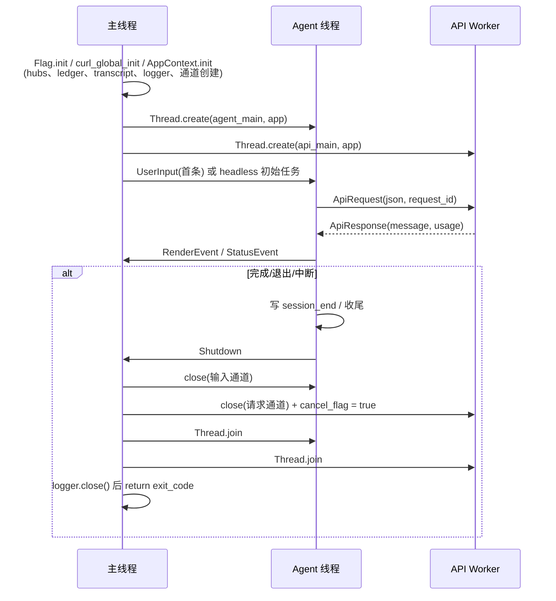
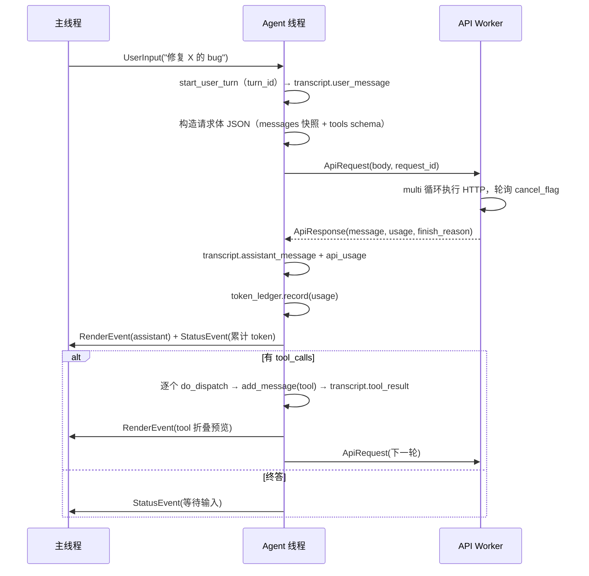

# 架构演进方案：统一 AppContext 与多线程（草案）

> 状态：**方案已定稿**——OQ-1~OQ-7 全部决议（见 §11），待实施。本文是 `docs/arch.md`（v1 单线程架构）的演进方案。
> 基线版本 1.0.0。目标版本 **2.0.0**（OQ-6 已定；线程模型是内部破坏性变化，对外 CLI/transcript 格式保持兼容）。
> 已验证的事实基础：c3c 0.8.3（`std::threads` 提供 `Thread` + buffered/unbounded channel（带 close/阻塞 pop）、`std::atomic`、`std::collections::blockingqueue`）；lib/curl.c3l 已声明完整 `multi_*` API（含 `multi_poll` / `multi_wakeup` / `multi_info_read`）；Windows 的 `SetConsoleCtrlHandler` 未在 stdlib 绑定中，需自加 extern 声明；POSIX 有 `install_signal_handler`。

---

## 1. 背景与动机

### 1.1 现状问题清单

| # | 问题 | 现状 | 后果 |
| --- | --- | --- | --- |
| 1 | **状态散落** | `global.c3`（tlocal GlobalStore）、`Context`、`log.c3`（tlocal File）、`transcript.c3`（无状态函数，靠 global 读配置）、`skill.c3`（预留的 `_global_context` 全局变量）五处各管一摊 | 新增子系统无处安放；跨模块访问全靠 `global::`，测试要模拟全局 |
| 2 | **token 用量只落盘不管理** | `api.c3` 每请求解析 usage → 只写 `api_usage` 事件，无会话级累计、无预算、无阈值告警 | 无法感知上下文窗口逼近上限；将来 compaction 没有数据基础 |
| 3 | **单线程阻塞，无法中断** | `rat_loop` 中 `api::completions()` 直接阻塞在 `curl::easy_perform`；工具（Bash）执行同样阻塞 | Ctrl+C 只能杀进程；请求进行中无法优雅停止，transcript 留下半截 turn |
| 4 | **UI 与逻辑耦合** | `rat_loop` 内直接调 `ui::render_message()` / `ui::read_prompt()`；输出直接写 stdout | 渲染点无法重排；多线程后必然交错输出 |
| 5 | **依赖方向杂** | `api.c3` 依赖 transcript、global、log；`transcript` 依赖 global、tool；`context` 依赖 cli/skill/tool | 模块职责边界模糊，改造牵一发动全身 |

### 1.2 目标

1. **一个 AppContext 管全局**：tools、skills、system prompt、token 账本、transcript、logger、运行时信号统一挂载在一个对象上，一处初始化、一处持有、按所有权分区访问。
2. **三线程模型**：UI/UX 在主线程，Agent loop 独立线程，API 调用独立 worker 线程——核心目的是**可中断**。
3. **行为兼容**：CLI 参数、transcript 事件 schema（v1）、`--resume`、Task 子代理机制、hashline/HashEditFile 全部保持不变；`c3c test` 与进程级集成测试继续通过。

---

## 2. 需求细化

### 2.1 功能需求

| ID | 需求 | 验收标准 |
| --- | --- | --- |
| FR-1 | **统一 AppContext**：`AppContext` 结构体持有配置（Flag 副本）、会话状态（session_id/messages/turns_total/时间戳）、`ToolHub`、`SkillHub`、`TokenLedger`、`TranscriptWriter`、`Logger`、取消标志与线程句柄 | `global.c3` 删除或缩小为启动引导桥；grep 全库无 `global::` 业务调用；任一模块均可经 `AppContext*` 拿到全部子系统 |
| FR-2 | **Token 账本**：每请求 usage 回报后累计到会话级账本（prompt/completion/reasoning），可查询会话累计、本轮累计、最近 N 次请求 | 提供 `TokenLedger` 单元测试（累计正确性）；`/usage` 或状态行可显示累计 token（交互模式） |
| FR-3 | **Token 预算**：可配置上下文窗口上限与软/硬阈值；请求前检查，超软阈值告警（写 system_event + UI 提示），超硬阈值拒绝请求并引导 compaction（v1 只告警，compaction 预留） | 阈值可经 `--max-tokens`/config 配置；触发时 transcript 有 `system_event(token_warning)` |
| FR-4 | **API 独立线程**：Agent 线程把序列化好的请求体 JSON + request_id 投递给 API worker 线程，worker 执行 HTTP 并返回 Message/usage/错误 | headless 全流程集成测试通过；transcript 输出与 v1 逐字节一致（golden diff） |
| FR-5 | **Agent 独立线程**：`rat_loop` 逻辑（turn 管理、tool 游标调度、消息装配、transcript 事件写入、token 记账）整体迁移到 Agent 线程 | 交互与 headless 均通过既有集成测试 |
| FR-6 | **UI 主线程**：所有 stdout/stderr 输出（banner、消息渲染、notice、日志控制台输出）只发生在主线程；Agent/API 线程经事件通道投递渲染请求 | 代码审查保证其他线程零 `io::print`；长输出不交错 |
| FR-7 | **请求级中断**：交互模式下按 Ctrl+C（或 Esc）中断进行中的 API 请求：HTTP 请求被干净取消，Agent 丢弃未完成 turn（不留半截 assistant 消息），回到输入提示，transcript 写 `system_event(request_cancelled)` | 对慢速本地 mock server 发请求后中断，进程存活、transcript 合法、`--resume` 可恢复 |
| FR-8 | **headless 中断语义**：headless 下 Ctrl+C = 优雅停机：取消请求、写 `session_end(reason=interrupted)`、exit 非零 | 同 FR-7 测试，断言 session_end 事件与退出码 |
| FR-9 | **transcript 对象化**：`TranscriptWriter` 挂在 AppContext 上，持有 session_id/enabled/file 路径；全部事件写入**只在 Agent 线程发生**（UI 线程把输入/命令事件转发给 Agent 后由 Agent 落盘） | transcript 写点线程唯一，无需锁；`--no-transcript` 行为不变 |
| FR-10 | **logger 对象化**：`Logger` 挂在 AppContext 上（级别过滤 + 控制台 sink + 文件 sink），内部 mutex 保护文件句柄；控制台输出经 UI 事件转发到主线程（避免交错） | 多线程下日志文件行完整、无交错字节；级别语义与现在一致（info→stdout 其余→stderr） |
| FR-11 | **Skill/Tool 作为只读资源**：hub 初始化完成后只读，`schema_cache` 预计算；不做运行时热插拔（v1 范围） | 无锁访问；`--list-skills` 行为不变 |
| FR-12 | **Task 子代理兼容**：`Task` 工具仍 spawn `mp` 子进程 + `MP_PARENT_SESSION` 环境变量；父 request_id 改从 AppContext 读取（Agent 线程持有） | 子代理集成测试通过，parent 关联字段不变 |
| FR-13 | **退出协调**：`/exit`、headless 完成、Ctrl+C 均走统一 shutdown 协议：停止 Agent → 关闭通道 → join 线程 → `log::close()` → 返回退出码 | 三种退出路径均无 hang、无孤儿线程（线程 join 断言） |

### 2.2 非功能需求

| ID | 需求 |
| --- | --- |
| NFR-1 | **内存规则**：跨线程传递的负载一律分配到堆（`alloc::heap()` 或接收方 allocator），`tmem`（线程局部临时分配器）绝不跨线程共享；AppContext 的 messages 分配在堆 arena |
| NFR-2 | **无共享可变消息**：API worker 不读 `messages` 列表——Agent 线程序列化请求体快照后投递，杜绝锁竞争与指针失效 |
| NFR-3 | **确定性**：同一输入下 transcript 事件序列与 v1 一致（golden 测试），便于迁移期回归 |
| NFR-4 | **渐进迁移**：每个阶段独立可编译、可测试、可发布，不出现“大爆炸”式重构 |

### 2.3 明确不做

- 工具并行执行（多 tool_call 并行 dispatch、线程池）——**永久不做**（OQ-2 已定）
- transcript compaction 实现（仅预留接口与 `compact_boundary` 事件）
- `config.json` 配置文件读取（OQ-5 已定 B：**单独立项**，不并入本次重构）
- 打字机式流式渲染（OQ-1 已定 A：保持一次性渲染）
- TUI 框架（保持行式输出）

---

## 3. 目标架构总览



> 关键点：`AppContext` 是**单写者多读者**结构——可变状态（messages、token、turns、request_id）只有 Agent 线程写；UI 与 API worker 只通过通道收发**消息副本**。只有两处共享可变原语：`atomic cancel_flag` 与 `Logger` 内部 mutex。

---

## 4. 核心设计 A：统一 AppContext

### 4.1 结构草案（C3 伪代码）

```c3
module app;

struct AppContext
{
    // ---- 配置（初始化后只读）----
    Flag flag;                    // Flag 拷贝（不再传 Flag*，避免生命周期纠缠）
    Allocator allocator;          // &allocators::LIBC_ALLOCATOR（堆），非 tmem
    Path cwd;
    Path config_dir;

    // ---- 会话状态（Agent 线程单写）----
    String session_id;
    List{Message} messages;
    int turns_total;
    DateTime started_at;
    DateTime updated_at;
    bool resumed;

    // ---- 资源（初始化后只读）----
    ToolHub* tool_hub;
    SkillHub* skill_hub;
    String system_prompt_snapshot;  // 装配产物（session_start/resume 用）
    String tools_schema_json;       // schema_cache 预计算产物

    // ---- 子系统（对象化，挂载点）----
    TokenLedger* token_ledger;
    TranscriptWriter* transcript;
    Logger* logger;

    // ---- 运行时信号 ----
    Atomic(bool)* cancel_flag;      // Ctrl+C / Esc → true（跨线程）
    Thread* agent_thread;
    Thread* api_thread;
}

// 装配系统提示词（原 Context.reset 的职责，抽取为可重入函数）
fn String PromptAssembly.build(&self, Allocator allocator, AppContext* app);
// = 模板渲染（{{cwd}}/{{date}}/{{os}}）+ behavioral_guideline + tools 列表
//   + tools_memo + AGENTS.md(<project_instructions>) + skills 列表
```

**`global.c3` 的去留**：启动早期（main 中 `Flag.init` 之后、`AppContext` 构造之前）仍需一个引导桥供 `log::init`/transcript 路径使用。方案：`AppContext.init()` 取代 `global::update()`；`global.c3` 删除，`log`/`transcript` 的初始化参数改由 main 显式传入。`log::init()` 改为 `app.logger.init()`。

### 4.2 所有权与线程分区

| 字段组 | 写者 | 读者 | 同步机制 |
| --- | --- | --- | --- |
| flag / hubs / schema / system_prompt_snapshot | main（启动期） | 所有线程 | 无（初始化后只读） |
| messages / turns_total / session_id / request_id | Agent | Agent（API 请求构造也在 Agent 内做快照） | 无 |
| token_ledger | Agent | UI（经事件） | 无（UI 只读事件携带的副本） |
| transcript | Agent | — | 无（写点唯一，见 FR-9） |
| logger 文件句柄 | 任意线程 | — | 内部 mutex |
| cancel_flag | 任意线程 set | API worker / Agent 轮询 | atomic |

### 4.3 子系统对象化明细

#### 4.3.1 TokenLedger（新增，src/app/token_ledger.c3）

```c3
struct TokenUsage { long prompt_tokens; long completion_tokens; long reasoning_tokens; }

struct TokenLedger
{
    TokenUsage session_total;      // 会话累计
    TokenUsage turn_total;         // 当前 turn 累计
    TokenUsage last_request;       // 最近一次请求
    List{UsageRecord} history;     // 可选：最近 N 条明细（供 UI 状态行/告警）
    long context_window_limit;     // 上下文窗口上限（默认按模型估或 0=不启用）
    double soft_ratio;             // 软阈值（默认 0.8）
    double hard_ratio;             // 硬阈值（默认 0.95）
}

fn void TokenLedger.record(&self, String request_id, TokenUsage usage);
fn long TokenLedger.estimated_prompt_tokens(&self);  // 估算下轮 prompt 大小（近似）
fn BudgetVerdict TokenLedger.check_budget(&self);    // OK / WARN / EXCEEDED
```

- 数据来源不变：`api.c3` 的 `ApiMeta.usage` 由 API worker 回报给 Agent，Agent 调 `record()` 并写 `api_usage` 事件。
- 阈值触发：`WARN` → `system_event(token_warning)` + UI 状态行提示；`EXCEEDED` → 拒绝继续请求，提示用户 `/clear` 或等待 compaction（v1 只实现到 WARN 的落盘与展示）。
- 新增 CLI：`--max-tokens <n>`（可选，0 = 不启用）。

#### 4.3.2 TranscriptWriter（src/transcript.c3 重构）

- 现状：7 个模块级 `write_*` 函数，参数散传 `(allocator, session_id, turn_id, request_id, ...)`，内部读 `global::config_dir()`。
- 目标：`TranscriptWriter { Allocator allocator; String session_id; bool enabled; }`，方法签名去掉 session_id（从 self 取），**全部调用点只在 Agent 线程**（UI 线程把 user_message/命令事件经通道转交 Agent 落盘）。
- `resume_into()` 改为 `TranscriptWriter.resume_into(AppContext*)`。
- 事件 schema 不变（v1），新增一个 `system_event` subtype：`request_cancelled`（请求级中断标记，additive，兼容旧 resume）。
- `--no-transcript` 时 writer 内部全 no-op，与现在一致。

#### 4.3.3 Logger（src/log.c3 重构）

- 现状：`tlocal File _log_file` + 模块级 `_to_file`，控制台直接 `io::printfn`。
- 目标：

```c3
struct Logger
{
    File? log_file;            // 文件 sink（mutex 保护）
    Mutex mu;
    LogLevel level;            // debug 受 flag 控制
    LogSink console_sink;      // 控制台输出经 UI 事件转发（见下）
}
```

- 两级设计：**文件 sink 任意线程可写**（mutex + 单次 fprintf + flush）；**控制台 sink 只走主线程**——非 UI 线程的日志转成 `LogEvent` 投递 UI 通道，由主线程统一打印，保证不交错。
- 日志格式（`[时间戳] [级别] 消息`）与级别→流映射（info→stdout，其余→stderr）保持不变。

#### 4.3.4 ToolHub / SkillHub

- 职责不变，改动点：
  - `ToolHub.init()` 时预计算 `schema_cache` 与工具名列表（写入 AppContext，避免后续惰性写）；
  - `do_dispatch()` 仍在 Agent 线程内**串行**执行（OQ-2 已定：永久串行）；
  - `TaskTool` 的父 request_id 从 `AppContext` 读（Agent 线程持有，无 tlocal）；
  - `skill.c3` 中预留的 `_global_context` 全局变量删除。

#### 4.3.5 PromptAssembly（src/context 重构）

- 现状：`Context.reset()` 内联装配 system prompt。
- 目标：`PromptAssembly` 可重入函数（`/clear` 时重新装配；`--resume` 时用快照），产物存入 `AppContext.system_prompt_snapshot`，`session_start` 事件直接引用。
- `Context` 结构体本身合并进 `AppContext`；`Message`/`ToolCall` 类型独立为叶子模块 `src/message.c3`（并入 `app` 会与 `transcript` 循环 import，故独立）。

### 4.4 tmem 与跨线程内存规则（NFR-1 落地）

> ⚠️ **关键事实（实验证实）**：`tmem`（线程局部临时分配器）**不会在新线程上隐式创建**——线程函数里直接使用 `tmem` 会 panic（`Use '@pool_init()' to enable the temp allocator on a new thread`）。Agent/API 线程函数必须用 `@pool_init` 包裹：

```c3
fn int agent_main(void* arg)
{
    @pool_init(&allocators::LIBC_ALLOCATOR, 1024 * 1024 * 8)
    {
        // 此处 tmem 可用；作用域结束自动销毁本线程的临时分配器
    };
    return 0;
}
```

| 规则 | 说明 |
| --- | --- |
| R1 | `AppContext.allocator = &allocators::LIBC_ALLOCATOR`（`std::core::mem::allocators`，需项目开启 `LIBC` feature；c3 0.8.3 无 `alloc::heap()`）；`messages` 及其中全部 String/ToolCall 用该 allocator |
| R2 | 跨线程通道负载（UserInput/RenderEvent/ApiRequest/ApiResponse）一律 heap 分配，接收方处理完显式释放 |
| R3 | `tmem` 仅限线程内短生命周期临时值（解析、拼接中间态）；绝不放入消息、通道负载或 AppContext。**新线程须先 `@pool_init`** |
| R4 | `cjson` 实例不跨线程：SSE 解析在 API worker（自己的树），工具参数解析在 Agent（自己的树）；`init_mem_hooks` 在 main 启动时调用一次（并发安全已实验验证，见 §13） |
| R5 | 线程结束前释放其持有的堆分配（c3c test 的泄漏检测对多线程同样生效，需验证） |
| R6 | 传给 C 函数（curl 等）的 URL 等字符串必须 NUL 结尾：`string::format(tmem, ...)` 可用，`string::tformat(...)` 的返回值**不保证** NUL 结尾（实验中导致 curl 读到垃圾 URL → 414）；跨线程的 C 字符串用堆分配 + `zstr_copy` |

---

## 5. 核心设计 B：线程模型

### 5.1 三线程职责

| 线程 | 模块 | 职责 | 禁止 |
| --- | --- | --- | --- |
| **主线程（UI）** | main / ui / 信号处理 | `AppContext` 初始化与所有权；stdin 读输入（交互模式）；事件循环：RenderEvent 渲染、LogEvent 打印、StatusEvent 状态行；Ctrl+C 捕获置 `cancel_flag`；shutdown 协调与 join | 直接读写 messages/token/transcript；直接调 API |
| **Agent 线程** | rat_loop / tool / transcript / token_ledger | turn 管理（`start_user_turn`）、工具游标调度、消息装配、构造请求体快照、transcript 全部事件写入、token 记账、`/clear` `/export` 处理 | 阻塞等待 stdin；直接执行 HTTP |
| **API Worker 线程** | api / http_client | 收 `ApiRequest` → curl multi 事件循环执行 → SSE 解析为 Message → 回传 `ApiResponse`；轮询 `cancel_flag` 支持取消 | 读 messages；写 transcript（usage 由 Agent 落盘） |

### 5.2 通道拓扑（std::threads::channel）



事件类型草案：

```c3
// ui → agent（unbounded channel）
struct UiEvent { UiEventType type; String text; }   // USER_INPUT / COMMAND_CLEAR / COMMAND_EXIT / CANCEL_REQUEST / CANCEL_TOOL

// agent → ui（unbounded channel）
struct RenderEvent { RenderKind kind; Message* msg; String tool_name; }   // 消息渲染/折叠预览
struct StatusEvent { String text; }                  // 状态行（token 用量、DONE、Bye 等）
struct LogEvent { LogLevel level; String text; }     // 非 UI 线程日志转发

// agent → api（buffered，容量 1）与 api → agent（unbounded）
struct ApiRequest { String request_id; String body_json; String url; List{String} headers; }
struct ApiResponse { String request_id; Message* message; ApiMeta meta; ApiErrorCode error; bool cancelled; }
```

选型理由：
- `unbounded_channel`：UI 事件与 API 响应（生产速率不可控），避免背压死锁；
- `buffered_channel`（容量 1）：Agent 一次只投一个请求，天然背压；
- 通道 `close()` 作为 shutdown 信号：**已验证**——`close()` 后阻塞 `pop()` 会先排空队列中剩余元素，随后返回 `thread::CHANNEL_CLOSED` fault（不是 null）。接收循环的标准写法：

```c3
while (true)
{
    Type? item = chan.pop();
    if (catch e = item)
    {
        if (e == thread::CHANNEL_CLOSED) break;   // shutdown 信号
        // 其他 fault 另行处理
    }
    // 处理 item
}
```

### 5.3 生命周期



要点：
- `curl_global_init` 必须在创建任何线程前、在 main 调用一次（多线程下 libcurl 的硬要求，现状依赖隐式初始化，改多线程后必须显式）。
- headless 与交互共用同一线程拓扑：headless 下主线程只做“投递初始任务 + 等待 Shutdown + join”，UI 渲染仍走事件（与现在 headless 也渲染消息的行为一致）。
- `/clear` 在 Agent 线程内完成（写旧会话 session_end(interrupted) → 新 session_id → 重新装配 system prompt → 回发 StatusEvent 通知 UI 新 session id）。

### 5.4 Agent 线程的循环结构与状态机

Agent 线程生命周期 = 整个会话，线程函数内部是**状态机驱动的 while 循环**（OQ-7 已定 A）。v1 的隐式状态（`calling_tools` 布尔 + 游标）升级为显式 enum：

```c3
enum AgentState
{
    IDLE,            // 等待用户输入
    AWAITING_API,    // 已投递请求，阻塞等 API 响应
    EXECUTING_TOOLS, // 逐个执行 tool_calls（永久串行，OQ-2）
    CANCELLING,      // 收到取消：丢弃半成品 turn，清理后回 IDLE
    SHUTDOWN,        // 收尾（session_end）→ 线程退出
}

fn int agent_main(void* arg)
{
    AppContext* app = (AppContext*)arg;
    @pool_init(&allocators::LIBC_ALLOCATOR, 8 * 1024 * 1024)
    {
        // 初始化：reset()/resume_into()、写 session_start
        AgentState state = IDLE;

        while (state != SHUTDOWN)
        {
            switch (state)
            {
                case IDLE:
                    // 阻塞点 1：等输入/命令/取消
                    UiEvent? ev = app.ui_to_agent.pop();
                    if (catch e = ev) break;                 // CHANNEL_CLOSED → SHUTDOWN
                    if (ev.type == COMMAND_EXIT) { ...; state = SHUTDOWN; }
                    else { start_user_turn(...); push(ApiRequest); state = AWAITING_API; }
                case AWAITING_API:
                    // 阻塞点 2：等响应
                    ApiResponse? resp = app.api_to_agent.pop();
                    if (resp.cancelled) { state = CANCELLING; }
                    else if (resp.message.tool_calls.len() > 0) { state = EXECUTING_TOOLS; }
                    else { /* 终答渲染 */ state = IDLE; }
                case EXECUTING_TOOLS:
                    if (还有未执行 tool_call) { do_dispatch 下一个; }   // 串行
                    else { push(ApiRequest); state = AWAITING_API; }
                    // L2 取消：UI 事件在取消标志上 → 杀子进程 → state = CANCELLING
                case CANCELLING:
                    // 丢弃半成品 turn（OQ-3：不写 tool_result）
                    // 写 system_event(request_cancelled / tool_cancelled)
                    state = IDLE;
            }
        }
        // 收尾：写 session_end
    };
    return 0;
}
```

状态迁移表（中断正确性的显式规则）：

| 状态 | 事件 | 下一状态 | 动作 |
| --- | --- | --- | --- |
| IDLE | UserInput | AWAITING_API | `start_user_turn` + 构造请求体快照 + 投递 |
| IDLE | `/clear` 命令 | IDLE | 旧会话收尾(interrupted) + 新 session + 重装配 prompt |
| IDLE | `/exit` 命令 / 通道关闭 | SHUTDOWN | 写 session_end |
| AWAITING_API | 响应无 tool_calls | IDLE | 终答渲染 |
| AWAITING_API | 响应有 tool_calls | EXECUTING_TOOLS | 记游标 |
| AWAITING_API | cancelled（L1） | CANCELLING | 写 system_event(request_cancelled) |
| AWAITING_API | API 错误 | IDLE（交互）/ SHUTDOWN（headless） | 同 v1 语义 |
| EXECUTING_TOOLS | 还有未执行 tool_call | EXECUTING_TOOLS | 串行 do_dispatch 下一个 |
| EXECUTING_TOOLS | 全部执行完 | AWAITING_API | 再请求 |
| EXECUTING_TOOLS | 工具中断（L2） | CANCELLING | 杀子进程 + system_event(tool_cancelled) |
| CANCELLING | 清理完成 | IDLE | 丢弃半成品 turn（OQ-3） |

- **不是忙等**：两个阻塞点都在 channel `pop()` 上（等 UI 输入 / 等 API 响应），空闲时零 CPU。API 取消由 worker 轮询 `cancel_flag`，Agent 只收 `cancelled` 响应。
- **线程常驻**（非每 turn 建线程）：turn 状态（`turn_id` / `tool_call_cursor` / `pending_assistant_idx`）留在状态机局部变量，这也是「messages/token/transcript 全部由 Agent 单写、无需锁」的前提。
- **退出路径唯一**：`/exit`、headless 完成、Ctrl+C 全部汇聚到 SHUTDOWN（close 输入通道 → `CHANNEL_CLOSED` → 收尾 → join）。

---

## 6. 核心设计 C：中断支持

### 6.1 Ctrl+C 捕获

- **Windows**：`SetConsoleCtrlHandler`（kernel32）未在 `std::os::win32` 绑定中，需在项目内新增一个 extern 声明（3 行）：

```c3
// src/util/win32_console.c3（$if env::WIN32）
extern fn Bool SetConsoleCtrlHandler(HandlerRoutine* handler, Bool add) @cname("SetConsoleCtrlHandler");
```

  handler 内**只做一件事**：`cancel_flag.store(true)`（atomic store 在信号 handler 中是安全的）。返回值 TRUE 表示已处理，阻止默认终止。
- **POSIX**：`std::os::posix::install_signal_handler(SIGINT, handler)` 同上，只置标志。
- 主线程事件循环中观察到标志：交互模式 → 投递 `CANCEL_REQUEST` 给 Agent；Agent 判断当前状态（等 API → 转投 API worker 取消；执行工具中 → 见 6.3；等输入 → 忽略）。

### 6.2 API 请求取消协议（curl multi）

现状 `http_client` 用 blocking 的 `easy_perform`，无法从外部中止。改为 API worker 内的事件循环：

```c3
// api worker 主循环伪代码
loop
{
    ApiRequest? req = request_channel.pop();      // 阻塞收
    if (!req) break;                              // 通道关闭 → 退出

    Curl* easy = curl::easy_init();               // 每请求独立 handle（线程内复用亦可）
    // ... 设置 URL/POSTFIELDS/WRITEFUNCTION（复用现有逻辑）...
    CurlM* multi = curl::multi_init();
    multi_add_handle(multi, easy);

    bool cancelled = false;
    while (true)
    {
        int running = 0;
        multi_poll(multi, null, 0, 100, &running);   // 100ms 超时轮询
        multi_perform(multi, &running);
        if (cancel_flag.load()) { cancelled = true; break; }   // 中断点
        if (running == 0) break;                              // 正常完成
    }

    // 收集结果：multi_info_read 取 CURLMSG_DONE → easy_getinfo(RESPONSE_CODE)
    // cancelled 时丢弃 response_buffer，返回 ApiResponse{cancelled=true}
    multi_remove_handle(multi, easy);
    easy_cleanup(easy);
    multi_cleanup(multi);
}
```

- 取消延迟上限 = 100ms（poll 超时），可选 `multi_wakeup()` 立即唤醒。
- **不改** SSE 解析逻辑（`read_stream_to_message` 原样搬进 worker 线程）。
- 收到取消的 Agent：丢弃当前 turn 的半成品（不 add assistant 消息、不写 tool_result），写 `system_event(request_cancelled)`，回到输入态；交互模式显示 `(interrupted)` notice。

### 6.3 中断语义分级

| 级别 | 触发 | 行为 | 本期 |
| --- | --- | --- | --- |
| L1 请求中断 | Ctrl+C 且 Agent 处于“等待 API 响应” | 6.2 流程 | ✅ 阶段 3 |
| L2 工具中断 | Ctrl+C 且 Agent 正在执行 Bash/Task 等长工具 | 杀子进程（Windows: `TerminateProcess`；POSIX: kill 进程组）→ 丢弃半成品 turn（不写 tool_result），写 `system_event(tool_cancelled)`（OQ-3 已定 B） | ⏳ 阶段 4 |
| L3 会话中断 | 交互模式空闲时 Ctrl+C 或 `/exit` | 等价 `/exit`：写 session_end(exit) | ✅ 阶段 3 |

### 6.4 中断对 transcript 的影响

- 新增 `system_event` subtype `request_cancelled`（含 detail：request_id、已消耗 latency、是否有部分内容）。
- L1 中断后该 turn 没有 assistant_message/tool_result，与「未收尾 turn」语义一致——现有 `resume_into` 的尾部丢弃逻辑天然兼容，无需改 schema。

---

## 7. 一次请求的完整旅程（目标态）



---

## 8. 目录结构调整

```sh
src/
  app/
    app.c3              # AppContext：定义、init、所有权分区（取代 global.c3 的大部分）
    token_ledger.c3     # TokenLedger（新增）
    event.c3            # 事件类型定义 + 通道封装（新增）
    prompt_assembly.c3  # 系统提示词装配（并入 app 模块；模板 .md 同目录）
  message.c3            # Message/ToolCall 类型与生命周期（独立叶子模块）
  api/
    api.c3              # 请求体构造 + SSE 解析（纯函数化，去除 global/transcript 依赖）
    api_worker.c3       # worker 主循环 + curl multi（新增）
    http_client.c3      # easy handle 装配（保留，供 multi 复用）
  rat_loop.c3           # Agent 线程主函数（原 run() 的迁移）
  transcript.c3         # TranscriptWriter 对象化
  log.c3                # Logger 对象化（mutex + sink 分离）
  ui.c3                 # 渲染/输入纯函数 + UI 事件循环
  main.c3               # 初始化、线程创建、UI 事件循环、shutdown
  global.c3             # 删除（或仅剩启动引导常量）
  util/win32_console.c3 # SetConsoleCtrlHandler extern（新增，$if WIN32）
```

---

## 9. 迁移与实施计划

> 每阶段结束：`c3c build` + `c3c test` + headless 集成测试全绿，可独立发布。阶段 0 与线程无关，先落地统一。

| 阶段 | 内容 | 风险 | 验证 |
| --- | --- | --- | --- |
| **0. AppContext 统一**（单线程） | `AppContext` 承载 flag/hubs/messages/turns；`TokenLedger` 新增（累计 + `--max-tokens`）；`TranscriptWriter`/`Logger` 对象化（暂不加锁，单线程调用）；`global.c3` 删除；`PromptAssembly` 抽取；`skill` 全局变量清理 | 低（行为不变的重构） | 全量单测 + headless golden transcript diff |
| **1. 线程骨架** | 通道与事件类型；Agent 线程承载 rat_loop（`@pool_init` 包裹）；API worker 先用**原 blocking easy_perform**（取消暂不支持）；UI 线程事件循环（渲染经事件）；shutdown 协议；`curl_global_init` 显式化；Logger 加 mutex | 低-中（底层机制 R-1~R-4/R-7 已实验验证，主要工作在改造量） | 交互/headless 集成测试；线程 join 断言；golden diff |
| **2. curl multi 取消** | API worker 换 multi 事件循环；`cancel_flag`；`request_cancelled` 事件 | 中（multi 行为差异：响应收集、状态码读取） | mock 慢速 server 单测 + 中断集成测试（FR-7） |
| **3. Ctrl+C 与交互中断** | `SetConsoleCtrlHandler`/signal handler；L1/L3 中断语义；`(interrupted)` notice；headless 停机语义 | 中（Windows 控制台信号） | 手动 + 自动化中断测试（FR-7/8/13） |
| **4. 工具中断与增强** | L2 工具中断（杀子进程）；token 阈值 UI 展示完善；compaction 预留接口 | 高（子进程清理跨平台） | 长 Bash 命令中断测试 |

---

## 10. 风险与验证点

> 标注 ✅ 的已通过实验验证，细节见 §13 验证记录。

| # | 风险 | 状态 / 缓解 |
| --- | --- | --- |
| R-1 | **tmem 跨线程误用**：`tmem` 是线程局部临时分配器，跨线程引用即悬垂；且新线程不 `@pool_init` 直接用 tmem 会 **panic** | ✅ 已实验确认（panic 复现 + `@pool_init` 修复通过）；规范已写入 §4.4 R3 |
| R-2 | **libcurl 多线程初始化**：多线程下必须显式 `curl_global_init`，且先于线程创建 | ✅ 已验证（`curl_global_init(ALL)` → 多线程 multi 请求正常）；阶段 1 落地 |
| R-3 | **cjson 线程安全**：并发解析/序列化是否安全 | ✅ 已验证（3 线程 × 2000 次并发 parse/serialize 无异常）；`init_mem_hooks` 仍在 main 调用一次 |
| R-4 | **C3 channel 语义**：`close()` 后阻塞 `pop` 的行为 | ✅ 已验证（先排空队列，再返回 `thread::CHANNEL_CLOSED` fault，非 null）；标准写法见 §5.2 |
| R-5 | **readline 阻塞与信号**：主线程阻塞在 `io::readline` 时 Ctrl+C 的处理与 stdin 状态 | 未验证——阶段 3 前做 Windows 控制台行为实验；必要时换非阻塞输入轮询 |
| R-6 | **退出死锁**：Agent 等输入通道、主线程等 join 的循环等待 | 未验证——shutdown 协议固定顺序（5.3 时序图）；超时兜底（join 前发 cancel 并 close 全部通道） |
| R-7 | **multi 接口行为差异**：状态码/响应体收集方式与 easy 不同 | ✅ 已验证（200 响应体、状态码读取、取消路径均正常）；HTTP 错误码（429/500）回归留阶段 2 补齐 |
| R-8 | **渲染顺序**：并发事件下 UI 渲染顺序与 v1 单线程不一致 | 事件通道 FIFO 保证；golden diff 覆盖；视觉差异可接受（文档注明） |

---

## 11. 开放问题决议（OQ-1~OQ-7，全部已确认）

| # | 问题 | 选项 | 倾向 |
| --- | --- | --- | --- |
| OQ-1 | **流式渲染**：API worker 是否把 SSE delta 增量推给 UI（打字机效果）？ | A. 保持一次性渲染（简单）；B. 增量事件（体验好，中断时能看到部分输出；worker 需把 delta 事件推 Agent 再转 UI） | **已定：A**。SSE 解析与消息渲染均为一次性，中断时 UI 不显示半截输出，仅提示 `(interrupted)` |
| OQ-2 | **工具并行**：tool_calls 是否并行执行（需要工具线程池）？ | A. 保持串行；B. 独立 tool_calls 并行、依赖顺序的串行 | **已定：A**。工具执行永远串行，后续也不考虑并行 |
| OQ-3 | **L2 工具中断的落盘语义**：被中断的工具是否写 tool_result（output=`interrupted`）？ | A. 写（模型可感知）；B. 不写并整体丢弃 turn | **已定：B**。与 L1 统一为「丢弃半成品 turn + system_event 标记」，复用 resume 尾部丢弃逻辑 |
| OQ-4 | **headless 是否保留单线程快路径**（子代理进程无 UI 需求，省两线程开销）？ | A. 三线程统一（代码单一）；B. headless 走单线程 | **已定：A**。headless 下主线程只做「投递初始任务 + 等 Shutdown + join」 |
| OQ-5 | **config.json** 是否并入本次重构（logger/transcript/token 阈值都缺配置载体）？ | A. 并入（一并解决 TODO）；B. 继续只走命令行 | **已定：B**。config.json 单独立项，`--max-tokens` 先走命令行 |
| OQ-6 | **目标版本号**：2.0.0（破坏性架构）还是 1.1.0（行为兼容）？ | — | **已定：A，2.0.0**（架构分水岭，对外行为保持兼容） |
| OQ-7 | **Agent 状态机**：是否把 Agent loop 显式状态机化（idle / awaiting_api / executing_tools / cancelled）以支撑中断正确性？ | A. 显式 enum 状态机；B. 沿用游标式隐式状态 | **已定：A**。状态机定义见 §5.4 |

---

## 12. 附：与 v1 的兼容性承诺

- CLI 参数全集不变（新增 `--max-tokens` 可选）；
- transcript schema v1 不变（新增 `request_cancelled` subtype 为 additive；`resume_into` 兼容）；
- `MP_PARENT_SESSION` 子代理协议不变；
- hashline/HashEditFile 算法与工具行为不变；
- `--resume` 恢复语义不变（快照 system prompt + 丢尾部未收尾 turn）。

---

## 13. 验证记录（2026-08-15 实验）

实验代码：临时目录 `mp_verify`（c3c 0.8.3，依赖指向项目 lib/ 的 cjson/curl），三个独立实验：

| 实验 | 内容 | 结果 |
| --- | --- | --- |
| EXP1-THREAD | `Thread.create/join`；unbounded channel 传 heap 分配字符串；mutex 跨线程；`close()` 后 `pop` 语义；线程内 tmem | **PASS**。关键发现：新线程直接用 tmem 会 panic，线程函数须 `@pool_init(&allocators::LIBC_ALLOCATOR, size)` 包裹（详见 §4.4） |
| EXP2-CJSON | 3 线程（含主线程）同时 parse/serialize 独立 JSON 树各 2000 次，校验字段正确性 | **PASS**。cjson 独立树并发安全（默认 malloc/free hooks） |
| EXP3-CURLMULTI | `curl_global_init(ALL)` 先行；worker 线程 multi 循环（`multi_poll(100ms)` + `multi_perform` + `multi_info_read`）；对照：200 请求正常完成；主实验：慢请求（5s）400ms 后置 atomic 取消标志 | **PASS**。fast：200 + 响应体正确；slow：取消后 30ms 内退出（远小于 100ms 轮询窗口）；资源清理正常 |

已验证的 API 事实（写代码前必读）：

- 堆分配器：`std::core::mem::allocators::LIBC_ALLOCATOR`（项目需 `"features": ["LIBC"]`）；c3 0.8.3 没有 `alloc::heap()`。作为 Allocator 传参时取地址 `&allocators::LIBC_ALLOCATOR`。
- `Atomic{bool}`（花括号泛型语法），`.load()` / `.store(v)`。
- 通道：`channel::create_unbounded{String}(&allocators::LIBC_ALLOCATOR)!!` → `UnboundedChannel{String}*`；`push/pop/close` 如 §5.2。
- **NUL 结尾陷阱**：`string::tformat(...)` 的返回值不保证 NUL 结尾，传给 curl 的 URL 必须用 `string::format(tmem, ...)`（与现有 http_client 一致）或 `zstr_copy`；实验中 tformat URL 导致 curl 414。
- curl multi 最小循环（每请求独立 easy handle；worker 线程内创建/销毁 multi）：

```c3
Curl* easy = curl::easy_init();
// ...setopt（URL/WRITEFUNCTION/WRITEDATA/POST 等，同现有 http_client）...
CurlM* multi = curl::multi_init();
curl::multi_add_handle(multi, easy);
while (true)
{
    int running = 0;
    curl::multi_poll(multi, null, 0, 100, &running);   // 100ms 取消检查窗口
    curl::multi_perform(multi, &running);
    if (cancel_flag.load()) break;                     // 中断点
    if (running == 0) break;
}
int msgs = 0;
while (CurlMsg* msg = curl::multi_info_read(multi, &msgs))
    if (msg.msg == curl::CurlMsgType.DONE) { /* easy_getinfo 取 RESPONSE_CODE */ }
curl::multi_remove_handle(multi, easy);
curl::easy_cleanup(easy);
curl::multi_cleanup(multi);
```
