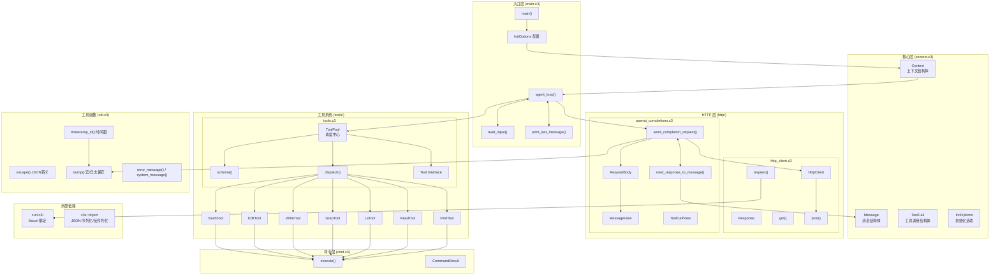

# 架构

## 模块说明

| 模块         | 文件                                     | 职责                                                                    |
| ------------ | ---------------------------------------- | ----------------------------------------------------------------------- |
| **入口层**   | `main.c3`                                | 程序入口、Agent 主循环、用户输入读取、消息打印                          |
| **配置层**   | `flags.c3`, `version.c3`                 | 命令行参数解析、版本信息管理                                            |
| **核心层**   | `context/`                               | Context/Message/ToolCall/InitOptions 等核心数据结构                     |
| **系统模板** | `context/system_prompt_template.md`      | 系统提示词模板，支持动态变量替换（cwd/date/os）                         |
| **HTTP 层**  | `http/http_client.c3`                    | HTTP 客户端封装 (GET/POST/request)，基于 libcurl                        |
| **API 层**   | `http/openai_completions.c3`             | OpenAI Chat Completions API 集成、请求构建、响应解析                    |
| **工具系统** | `tools/tools.c3`                         | ToolPool 调度中心、Tool 接口定义、工具注册与分发                        |
| **工具实现** | `tools/*_tool.c3`, `tools/*_schema.json` | 内置工具及其 JSON Schema：bash, edit, write, grep, ls, read, find, task |
| **命令层**   | `cmd.c3`                                 | 外部进程执行 (execute)、命令结果封装                                    |
| **工具函数** | `util.c3`                                | 路径哈希、时间戳、ANSI 格式化 (宏)、日志转储 (宏)、配置路径获取         |
| **外部依赖** | `lib/`                                   | `curl.c3l` (libcurl 绑定), `c3x::object` (JSON 处理)                    |

## 架构图

