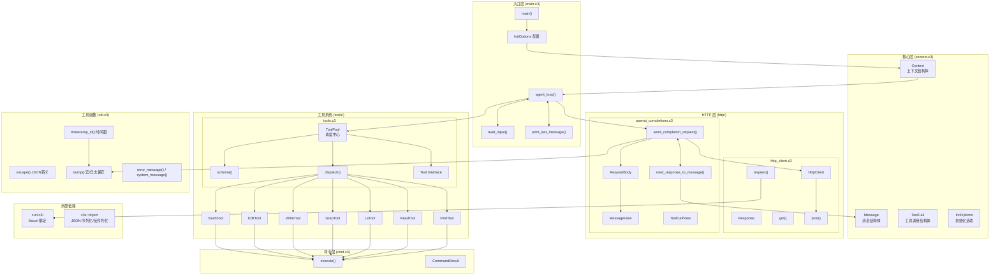

# 架构图

```mermaid
flowchart TB
    subgraph Entry["入口层 (main.c3)"]
        main["main()"]
        init["InitOptions 配置"]
        loop["agent_loop()"]
        read_in["read_input()"]
        print["print_last_message()"]
    end

    subgraph Core["核心层 (context.c3)"]
        ctx["Context\n上下文结构体"]
        msg["Message\n消息结构体"]
        tc["ToolCall\n工具调用结构体"]
        opts["InitOptions\n初始化选项"]
    end

    subgraph HTTP["HTTP 层 (http/)"]
        subgraph Client["http_client.c3"]
            http["HttpClient"]
            resp["Response"]
            get["get()"]
            post["post()"]
            request["request()"]
        end

        subgraph API["openai_completions.c3"]
            send["send_completion_request()"]
            parse["read_response_to_message()"]
            req_body["RequestBody"]
            msg_view["MessageView"]
            tc_view["ToolCallView"]
        end
    end

    subgraph Tools["工具系统 (tools/)"]
        subgraph Pool["tools.c3"]
            pool["ToolPool\n调度中心"]
            schema["schema()"]
            dispatch["dispatch()"]
            tool_if["Tool Interface"]
        end

        bash["BashTool"]
        edit["EditTool"]
        write["WriteTool"]
        grep["GrepTool"]
        ls["LsTool"]
        read_t["ReadTool"]
        find_t["FindTool"]
    end

    subgraph Cmd["命令层 (cmd.c3)"]
        exec["execute()"]
        result["CommandResult"]
    end

    subgraph Utils["工具函数 (util.c3)"]
        esc["escape() JSON转义"]
        ts["timestamp_id() 时间戳"]
        dump["dump() 宏/日志保存"]
        fmt["error_message() / system_message()"]
    end

    subgraph External["外部依赖"]
        cl["curl.c3l\nlibcurl 绑定"]
        c3x["c3x::object\nJSON 序列化/反序列化"]
    end

    main --> init --> ctx --> loop
    
    loop <--> read_in
    loop <--> print
    
    loop --> send
    send --> req_body
    req_body --> msg_view
    send --> http
    http --> post
    request --> cl
    
    send <--> parse
    parse --> msg
    send --> dump
    
    loop --> pool
    pool --> tool_if
    pool --> schema
    
    pool --> dispatch
    dispatch --> bash
    dispatch --> edit
    dispatch --> write
    dispatch --> grep
    dispatch --> ls
    dispatch --> read_t
    dispatch --> find_t
    
    bash --> exec
    edit --> exec
    write --> exec
    grep --> exec
    ls --> exec
    read_t --> exec
    find_t --> exec
    
    ts --> dump
```
