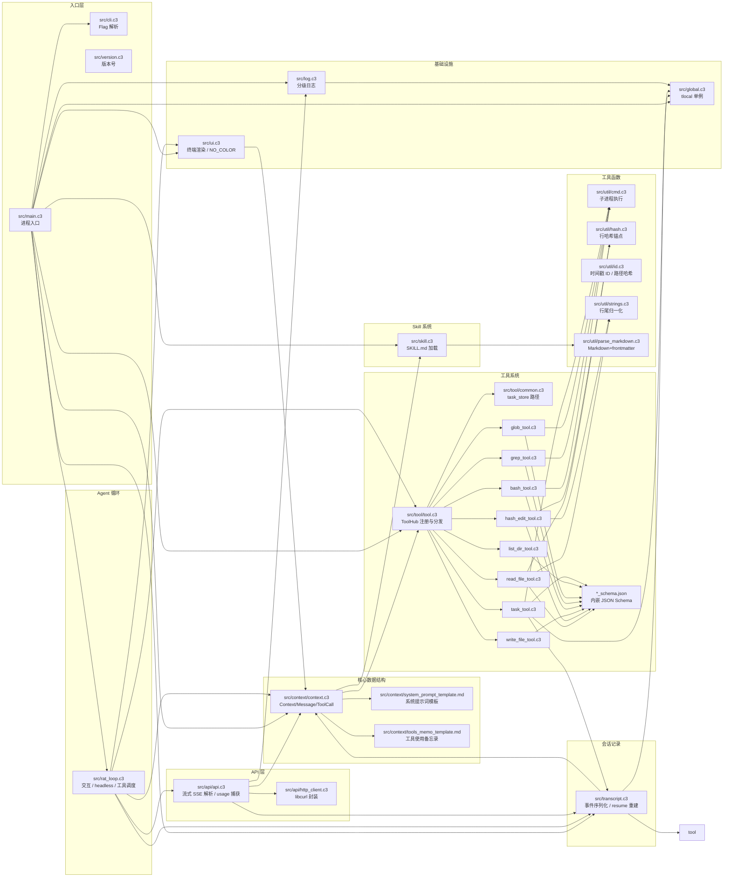
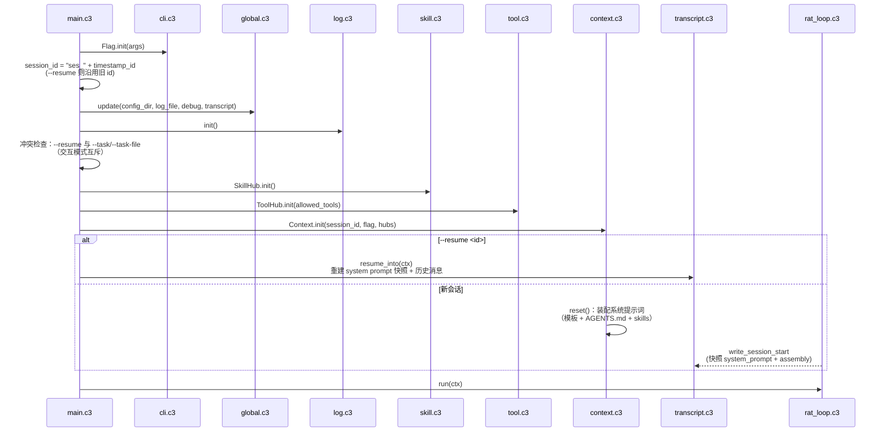
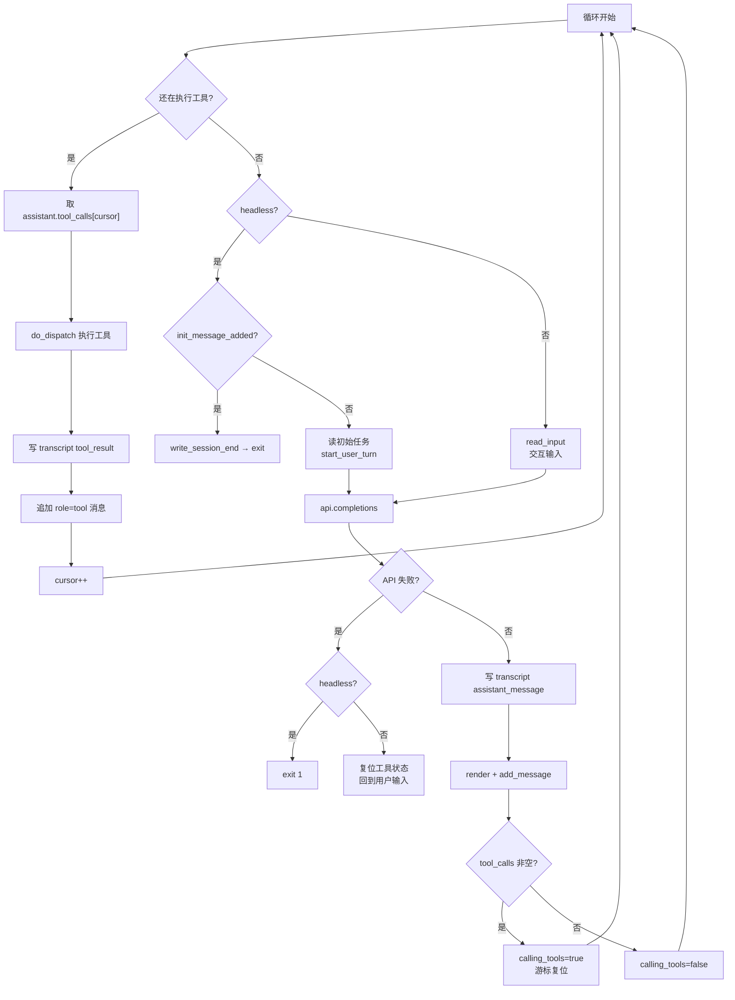
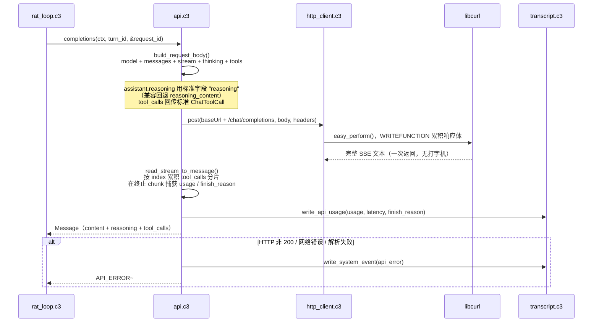
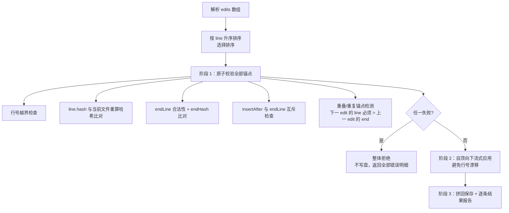
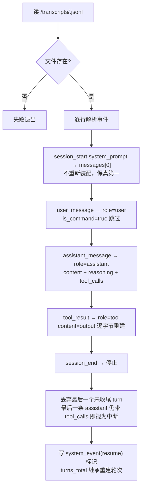

# 架构设计

> 面向开发者。版本对齐 `project.json`（当前 1.0.0）。
> 与 [transcript.md](transcript.md)（记录格式规范）、[flags.md](flags.md)（CLI）配套阅读。

## 1. 总览

`mp` 是一个用 C3 实现的命令行 coding agent：一个 **Agent Loop** 反复调用 OpenAI 兼容的 Chat Completions API，把模型产生的 `tool_calls` 逐个分发给内置工具执行，结果回填消息历史后继续请求，直到模型给出最终答复。

设计目标：

- **原生轻量**：单可执行文件 + libcurl 动态库；工具层大部分用外部 CLI（rg/fd/sh）或纯 C3 实现。
- **编辑可靠性**：以 `line:hash` 哈希锚点替代大段旧文本匹配，配合批量原子校验，杜绝工具并发修改导致的误编辑。
- **可审计可恢复**：每会话一份 JSONL transcript，记录每一步推理、工具调用与 token 成本；支持 `--resume` 断点续跑。
- **兼容性**：只依赖 OpenAI Chat Completions 协议子集（流式 SSE + tools + reasoning），可用任意兼容服务（DeepSeek / vLLM / LiteLLM 等）。


```mermaid
flowchart LR
    subgraph Entry["入口层"]
        main["src/main.c3<br/>进程入口"]
        cli["src/cli.c3<br/>Flag 解析"]
        version["src/version.c3<br/>版本号"]
    end

    subgraph Loop["Agent 循环"]
        rat["src/rat_loop.c3<br/>交互 / headless / 工具调度"]
    end

    subgraph Core["核心数据结构"]
        context["src/context/context.c3<br/>Context/Message/ToolCall"]
        sys_tpl["src/context/system_prompt_template.md<br/>系统提示词模板"]
        tools_memo["src/context/tools_memo_template.md<br/>工具使用备忘录"]
    end

    subgraph API["API 层"]
        api["src/api/api.c3<br/>流式 SSE 解析 / usage 捕获"]
        http["src/api/http_client.c3<br/>libcurl 封装"]
    end

    subgraph Tools["工具系统"]
        hub["src/tool/tool.c3<br/>ToolHub 注册与分发"]
        common["src/tool/common.c3<br/>task_store 路径"]
        t_read["read_file_tool.c3"]
        t_hash["hash_edit_tool.c3"]
        t_write["write_file_tool.c3"]
        t_bash["bash_tool.c3"]
        t_grep["grep_tool.c3"]
        t_glob["glob_tool.c3"]
        t_ls["list_dir_tool.c3"]
        t_task["task_tool.c3"]
        schemas["*_schema.json<br/>内嵌 JSON Schema"]
    end

    subgraph SkillSys["Skill 系统"]
        skill["src/skill.c3<br/>SKILL.md 加载"]
    end

    subgraph Transcript["会话记录"]
        trans["src/transcript.c3<br/>事件序列化 / resume 重建"]
    end

    subgraph Util["工具函数"]
        u_cmd["src/util/cmd.c3<br/>子进程执行"]
        u_hash["src/util/hash.c3<br/>行哈希锚点"]
        u_id["src/util/id.c3<br/>时间戳 ID / 路径哈希"]
        u_str["src/util/strings.c3<br/>行尾归一化"]
        u_md["src/util/parse_markdown.c3<br/>Markdown+frontmatter"]
    end

    subgraph Infra["基础设施"]
        g["src/global.c3<br/>tlocal 单例"]
        log["src/log.c3<br/>分级日志"]
        ui["src/ui.c3<br/>终端渲染 / NO_COLOR"]
    end

    main --> cli
    main --> g
    main --> log
    main --> ui
    main --> skill
    main --> hub
    main --> context
    main --> trans
    main --> rat

    rat --> context
    rat --> api
    rat --> hub
    rat --> trans
    rat --> ui

    api --> context
    api --> http
    api --> trans
    api --> log

    context --> sys_tpl
    context --> tools_memo
    context --> skill
    context --> hub

    hub --> common
    hub --> t_read & t_hash & t_write & t_bash & t_grep & t_glob & t_ls & t_task
    t_read & t_hash & t_write & t_bash & t_grep & t_glob & t_ls & t_task --> schemas

    t_read & t_hash --> u_hash
    t_read & t_hash --> u_str
    t_bash & t_grep & t_glob & t_task --> u_cmd
    t_task --> g
    t_task --> trans

    skill --> u_md
    trans --> g
    trans --> context
    trans --> tool
    log --> g
    ui --> context
```

## 2. 目录结构

```sh
src/
  main.c3                   # 入口：Flag 解析、session 创建、初始化、--resume 分支
  cli.c3                    # Flag 结构体与命令行解析（默认值、帮助文本）
  rat_loop.c3               # Agent 主循环（交互/headless 双模式、工具游标调度、transcript 事件写入点）
  skill.c3                  # Skill/SkillHub：扫描 ~/.agents/skills 与 .agents/skills
  transcript.c3             # 会话记录：7 类事件 JSONL 追加写盘；resume_into() 消息重建
  global.c3                 # tlocal GlobalStore 单例（config_dir/log_file/debug/transcript/session_id）
  log.c3                    # debug/info/warn/error 分级日志（控制台 + 文件）
  ui.c3                     # banner / render_message / read_prompt / notice；NO_COLOR
  version.c3                # 版本号（RELEASE 时由 scripts/version.sh 生成）
  context/
    context.c3              # Context/Message/ToolCall；系统提示词装配；render_to_markdown()
    system_prompt_template.md   # {{cwd}}/{{date}}/{{os}} 占位的系统提示词模板
    tools_memo_template.md      # 注入系统提示词的工具使用规范
  api/
    api.c3                  # completions()：请求体构造、SSE 流解析、tool_calls 分片累积、usage 捕获
    http_client.c3          # HttpClient：libcurl easy API 的 GET/POST 封装
  tool/
    tool.c3                 # Tool 接口、ToolHub（注册/schema 缓存/do_dispatch）
    common.c3               # load_store_dir()：<config_dir>/task_store
    read_file_tool.c3       # ReadFile：hashline 输出 + offset/limit
    hash_edit_tool.c3       # HashEditFile：哈希锚点原子编辑（核心特色）
    write_file_tool.c3      # WriteFile：创建/覆盖
    bash_tool.c3            # Bash：sh -c，2000 行截断 + 完整输出落盘
    grep_tool.c3            # Grep：rg 封装
    glob_tool.c3            # Glob：fd 封装
    list_dir_tool.c3        # ListDir：纯 C3 实现（不调外部 ls）
    task_tool.c3            # Task：spawn mp 子进程 + MP_PARENT_SESSION 注入
    *_schema.json           # 各工具 JSON Schema（$embed 编译期内嵌）
  util/
    cmd.c3                  # execute()/execute_to_string()：进程 spawn、关 stdin、合并 stderr
    hash.c3                 # line_hash()：FNV-1a 32 位 → 2 字符锚点
    id.c3                   # timestamp()/timestamp_id()/hash_path()
    strings.c3              # normalize_line_endings()/pad_start()
    parse_markdown.c3       # parse_markdown()：Markdown + YAML frontmatter
resources/
  agents/*.md               # 6 个预设 agent（基于 oh-my-opencode-slim 二次开发）
  skills/prd/SKILL.md       # 内置 skill
  error_responses/*.json    # 错误响应样本
lib/                        # cjson.c3l、curl.c3l
test/                       # 16 个测试文件（c3c test）
scripts/                    # release.sh / install.sh / version.sh
docs/                       # arch / flags / config / transcript / c3-intro / update-libcurl
```

## 3. 启动流程


```mermaid
sequenceDiagram
    participant main as main.c3
    participant cli as cli.c3
    participant g as global.c3
    participant log as log.c3
    participant skill as skill.c3
    participant hub as tool.c3
    participant ctx as context.c3
    participant trans as transcript.c3
    participant rat as rat_loop.c3

    main->>cli: Flag.init(args)
    main->>main: session_id = "ses_" + timestamp_id<br/>(--resume 则沿用旧 id)
    main->>g: update(config_dir, log_file, debug, transcript)
    main->>log: init()
    main->>main: 冲突检查：--resume 与 --task/--task-file<br/>（交互模式互斥）
    main->>skill: SkillHub.init()
    main->>hub: ToolHub.init(allowed_tools)
    main->>ctx: Context.init(session_id, flag, hubs)
    alt --resume <id>
        main->>trans: resume_into(ctx)<br/>重建 system prompt 快照 + 历史消息
    else 新会话
        ctx->>ctx: reset()：装配系统提示词<br/>（模板 + AGENTS.md + skills）
        rat-->>trans: write_session_start<br/>(快照 system_prompt + assembly)
    end
    main->>rat: run(ctx)
```

要点：

- `session_id` 由 `util::timestamp_id()`（本地时间 `YYYYMMDD_HHMMSS`）生成，前缀 `ses_`；`--resume` 时沿用被恢复会话的 id，transcript 继续追加同一文件。
- `Flag` 全部走命令行；`~/.config/mp/config.json` 读取**尚未实现**（见 [docs/flags.md](docs/flags.md)）。
- 系统提示词由 `Context.reset()` 装配：`system_prompt_template.md` 渲染（替换 `{{cwd}}/{{date}}/{{os}}`）→ 追加工具列表与 `tools_memo_template.md` → 追加 `AGENTS.md`（`<project_context>` XML）→ 追加已安装 skill 列表。

## 4. Agent 主循环（rat_loop.c3）

双模式共享同一个 `run()`：

| 模式 | 触发 | 行为 |
| --- | --- | --- |
| 交互 | 默认 | `read_input()` 读 stdin，处理 `/export` `/clear` `/exit` 斜杠命令 |
| Headless | `--headless` | `load_init_message()`（`--task` 或 `--task-file`）作为首条用户消息，完成后 `exit(0)` |

工具调用采用**游标式串行调度**（`tool_call_cursor` + `pending_assistant_idx`），避免并发与指针失效：


```mermaid
flowchart TD
    A[循环开始] --> B{还在执行工具?}
    B -->|是| C["取 assistant.tool_calls[cursor]"]
    C --> D[do_dispatch 执行工具]
    D --> E[写 transcript tool_result]
    E --> F[追加 role=tool 消息]
    F --> G[cursor++]
    G --> A
    B -->|否| H{headless?}
    H -->|是| I{init_message_added?}
    I -->|是| Z[write_session_end → exit]
    I -->|否| J[读初始任务<br/>start_user_turn]
    H -->|否| K[read_input<br/>交互输入]
    J --> L[api.completions]
    K --> L
    L --> M{API 失败?}
    M -->|是| N{headless?}
    N -->|是| O[exit 1]
    N -->|否| P[复位工具状态<br/>回到用户输入]
    M -->|否| Q[写 transcript assistant_message]
    Q --> R[render + add_message]
    R --> S{tool_calls 非空?}
    S -->|是| T[calling_tools=true<br/>游标复位]
    S -->|否| U[calling_tools=false]
    T --> A
    U --> A
```

关键点：

- **turn 与 request 双键**：每轮用户输入生成 `turn_id`；每次 API 调用生成 `request_id`，二者贯穿 transcript 全部事件。
- **API 错误处理**：headless 直接退出（避免死循环），交互模式复位工具状态回到用户输入。
- **`/clear`**：旧会话写 `session_end(interrupted)` → 生成新 `session_id` → 新 transcript 文件 → 重新装配系统提示词。

## 5. 一次 LLM 请求的消息流


```mermaid
sequenceDiagram
    participant rat as rat_loop.c3
    participant api as api.c3
    participant http as http_client.c3
    participant curl as libcurl
    participant trans as transcript.c3

    rat->>api: completions(ctx, turn_id, &request_id)
    api->>api: build_request_body()<br/>model + messages + stream + thinking + tools
    Note over api: assistant.reasoning 用标准字段 "reasoning"<br/>（兼容回退 reasoning_content）<br/>tool_calls 回传标准 ChatToolCall
    api->>http: post(baseUrl + /chat/completions, body, headers)
    http->>curl: easy_perform()，WRITEFUNCTION 累积响应体
    curl-->>http: 完整 SSE 文本（一次返回，无打字机）
    api->>api: read_stream_to_message()<br/>按 index 累积 tool_calls 分片<br/>在终止 chunk 捕获 usage / finish_reason
    api->>trans: write_api_usage(usage, latency, finish_reason)
    api-->>rat: Message（content + reasoning + tool_calls）
    alt HTTP 非 200 / 网络错误 / 解析失败
        api->>trans: write_system_event(api_error)
        api-->>rat: API_ERROR~
    end
```

- `build_request_body()` 只在启用工具时下发 `tools` + `tool_choice=auto`（空数组会触发部分 provider 报错）。
- 流式 `tool_calls` 以增量分片下发，`read_stream_to_message` 按 `index` 分组累积 `arguments`，支持单次回复多个工具调用、乱序到达（补齐中间空位）。
- `usage`（prompt/completion/reasoning tokens）与 `finish_reason` 在解析层捕获上抛，是 transcript `api_usage` 的硬前置。
- `--debug` 时请求/响应分别转储 `logs/req_<request_id>.json` 与 `logs/req_<request_id>_<status>.json`。

## 6. 工具系统

### 接口与调度

```c3
interface Tool
{
    fn String name();
    fn String description();
    fn String schema();          // JSON Schema 字符串（$embed 内嵌）
    fn void? execute(Allocator allocator, DString* out, CJsonItem* args, ToolResultMeta* meta);
}
```

- `ToolHub.init()` 按 `--tools` 列表（默认 8 个）顺序注册；未列出即不可用。
- `ToolHub.schema()` 拼接全部工具 schema 并缓存为格式化 JSON，供 `build_request_body` 下发。
- `do_dispatch()` 按名称线性查找并执行；未命中返回 `UNKNOWN_TOOL`。
- `ToolResultMeta`（`output_file` / `exit_code` / `has_exit_code`）为 transcript `tool_result` 事件提供补充字段，仅 Bash/Task 类工具填充。

### 外部命令封装

| 工具 | 命令 | 说明 |
| --- | --- | --- |
| Bash | `sh -c <cmd>` | 超 2000 行截断（保留末 2000 行），完整输出落盘 `<config_dir>/task_store/<id>_output.txt` |
| Grep | `rg <pattern> [--glob] [--ignore-case] [--fixed-strings] [-C n]` | 结果 trim 后直接返回 |
| Glob | `fd [-g] <pattern> [path]` | pattern 含 `*` 时加 `-g` |
| Task | `mp --agent X --headless -f <input> -o <output>` | 子进程递归调用自身 |
| ListDir | 纯 C3（`path::ls` + 排序 + 扩展名统计） | 目录优先、名称升序、人类可读大小、Summary 行 |

`cmd::execute()` 统一走 `process::spawn`，手工关闭 stdin（避免子进程挂起等输入），stderr 合并进 stdout。

## 7. 核心特色一：hashline + HashEditFile

### 7.1 hashline 锚点（src/util/hash.c3）

`ReadFile` 输出每行 `line:hash|content`。`line_hash()` 算法：

1. 去掉行尾 `\r` 与行尾空白；
2. 对归一化字节做 **FNV-1a 32 位** 哈希；
3. 取最低字节拆成两个 4-bit nibble，映射到字母表 `ZPMQVRWSNKTXJBYH` → 2 字符锚点；
4. **无字母数字的行**（空行、`{`、`}` 等）额外把 1-based 行号折叠进哈希状态，保证不同位置的同构行得到不同锚点。

只要求构建内自洽（模型读到什么、编辑就校验什么），不要求跨版本稳定。

### 7.2 HashEditFile（src/tool/hash_edit_tool.c3）

模型只需引用 `line` + `hash`，无需复述旧文本。支持四种操作（`EditOp`）：

| 操作 | 字段 | 语义 |
| --- | --- | --- |
| 单行替换 | `line` + `hash` + `content` | 用 `content` 替换锚点行 |
| 删除 | `line` + `hash` + `content=""` | 删除锚点行 |
| 区间替换 | 追加 `endLine` + `endHash` | 替换 `[line..endLine]`（含） |
| 插入 | `insertAfter=true` | 在锚点行**之后**插入 `content` |

**原子提交流程**（`hash_edit()`）：


```mermaid
flowchart TD
    A[解析 edits 数组] --> B[按 line 升序排序<br/>选择排序]
    B --> C[阶段 1：原子校验全部锚点]
    C --> C1[行号越界检查]
    C --> C2[line.hash 与当前文件重算哈希比对]
    C --> C3[endLine 合法性 + endHash 比对]
    C --> C4[insertAfter 与 endLine 互斥检查]
    C --> C5[重叠/重复锚点检测<br/>下一 edit 的 line 必须 > 上一 edit 的 end]
    C --> D{任一失败?}
    D -->|是| E[整体拒绝<br/>不写盘，返回全部错误明细]
    D -->|否| F[阶段 2：自顶向下流式应用<br/>避免行号漂移]
    F --> G[阶段 3：拼回保存 + 逐条结果报告]
```

设计要点：

- **先校验后写入**：任何锚点过期（文件在读取后被改动、或哈希抄错）→ 整批拒绝，文件零改动；错误信息逐条列出，引导模型重读文件。
- **防漂移**：edits 升序排列后单遍流式应用，替换区间一次性跳过被覆盖行。
- **报告完备**：成功时逐条报告（replaced / replaced with N line(s) / inserted N line(s) / deleted / range replaced），让模型知道每步结果。

> 注：旧版曾提供精确文本匹配的 `EditFile`（`oldText` 必须逐字节一致），已从工具注册表移除，编辑统一走 HashEditFile。`src/tool/edit_file_tool.c3` 与 `edit_file_tool_schema.json` 为未注册的死代码，可清理。

## 8. 核心特色二：transcript 会话记录（src/transcript.c3）

完整格式规范见 [transcript.md](transcript.md)，这里给架构视角。

### 8.1 写入模型

- **路径**：`<config_dir>/transcripts/<session_id>.jsonl`（`config_dir` 默认 `~/.config/mp/`）。
- **事件**：7 类 —— `session_start` / `user_message` / `assistant_message` / `tool_result` / `api_usage` / `system_event` / `session_end`。
- **双键贯穿**：`turn_id`（一轮）+ `request_id`（一次 API round-trip），所有事件携带。
- **追加即落盘**：打开 → 写入 → flush → 关闭，每事件一次；崩溃安全，无缓冲丢失。
- **静默失败**：transcript 只是记录层，任何 IO 错误不影响主流程；`--no-transcript` 时全部 write_* 为 no-op。

写入点分布：

| 事件 | 写入位置 |
| --- | --- |
| `session_start` | `rat_loop.c3` 装配完系统提示词后（快照 `messages[0]` + assembly） |
| `user_message` | `start_user_turn()`（交互输入与 headless 初始任务共用；斜杠命令标记 `is_command`） |
| `assistant_message` | `rat_loop.c3` 收到模型回复后 |
| `tool_result` | 每个工具执行完（`output` = 模型所见，逐字节等于 `role=tool` 消息；`output_file` 指向截断前的完整输出） |
| `api_usage` | `api.c3` 每次请求结束（usage/latency/model/finish_reason） |
| `system_event` | `api.c3`（`api_error`）、resume 标记等；`subtype`: api_error / local_command / resume / compact_boundary（占位） |
| `session_end` | 正常退出（exit）/ 错误退出（error）/ `/clear`（interrupted） |

### 8.2 子代理关联

`TaskTool` spawn 子进程时注入环境变量 `MP_PARENT_SESSION`（格式 `父session_id:父request_id`），子进程的 `session_start` 事件据此写入 `parent_session_id` / `parent_request_id`，还原整棵子代理树；`--no-transcript` 语义也通过命令行透传继承。

### 8.3 resume 重建（resume_into()）


```mermaid
flowchart TD
    A["读 <config_dir>/transcripts/<id>.jsonl"] --> B{"文件存在?"}
    B -->|否| Z["失败退出"]
    B -->|是| C["逐行解析事件"]
    C --> D["session_start.system_prompt → messages[0]<br/>不重新装配，保真第一"]
    D --> E["user_message → role=user<br/>is_command=true 跳过"]
    E --> F["assistant_message → role=assistant<br/>content + reasoning + tool_calls"]
    F --> G["tool_result → role=tool<br/>content=output 逐字节重建"]
    G --> H["session_end → 停止"]
    H --> I["丢弃最后一个未收尾 turn<br/>最后一条 assistant 仍带 tool_calls 即视为中断"]
    I --> J["写 system_event(resume) 标记<br/>turns_total 继承重建轮次"]
```

冲突规则：交互模式下 `--resume` 与 `--task`/`--task-file` 互斥；headless 允许组合（`mp --headless --resume <id> -t "继续"`），支撑 Task 子代理续跑。

## 9. Skill 系统（src/skill.c3）

- 扫描 `~/.agents/skills/*/SKILL.md`（全局）+ `.agents/skills/*/SKILL.md`（项目，基于 cwd），后者可覆盖前者同名项。
- 用 `util::parse_markdown()` 解析 YAML frontmatter，提取 `name` / `description`，正文作为 `content`；三者非空才算合法。
- `SkillHub.print_installed()` 以 `<skill><name>…<location>…</skill>` XML 形式注入系统提示词。
- 用户可在 `config_dir/SYSTEM.md` 提供自定义系统提示词模板（`Context.load_system_prompt_template()` 优先读取），失败回退内置模板。

## 10. 全局状态、日志与 UI

- **global.c3**：`tlocal GlobalStore` 线程级单例，保存 `config_dir` / `log_file` / `enable_debug` / `enable_transcript` / `session_id` / `active_request_id`，避免层层透传。`active_request_id` 供 Task 工具注入父 request。
- **log.c3**：debug 受 `global::debug()` 控制；info/warn/error 始终输出。控制台 info 走 stdout、其余走 stderr；文件统一追加 `<config_dir>/log/<session_id>.log`，纯文本无 ANSI。
- **ui.c3**：颜色集中在 UI 层，遵循 [NO_COLOR](https://no-color.org)（环境变量存在且非空即禁用）；`render_message` 模式无关（交互/headless 共用）。

## 11. 外部依赖与测试

| 依赖 | 用途 |
| --- | --- |
| `lib/curl.c3l` + `libcurl-x64.dll` | HTTP（运行时） |
| `lib/cjson.c3l` | JSON 序列化/解析（transcript、schema、请求体） |
| `rg`（ripgrep） | Grep 工具 |
| `fd` | Glob 工具 |
| `sh` | Bash 工具（`sh -c`） |

> ListDir 为纯 C3 实现（`std::io::path::ls`），不依赖外部 `ls`；`ls` 已从运行时依赖中移除。

测试：`c3c test`（16 个文件），重点覆盖 `hash_edit`（锚点校验与原子性）、`api_parse`（SSE 分片累积）、`transcript`（resume roundtrip）等。进程级集成测试以 headless 跑完整会话后断言 transcript 文件。

## 12. 已知取舍

- `--agent` 已解析但多 agent 差异化配置未实现；预设 agent 定义在 `resources/agents/` 预留。
- `config.json` 配置文件读取未实现，全部参数走命令行。
- transcript 不做 compaction：超长会话 resume 时消息数可能逼近 API 上下文上限（v1 接受，`compact_boundary` 事件已预留占位）。
- 请求/响应体在非 debug 模式下不落盘（隐私），debug 转储在 `logs/`，与 transcript 互补。
