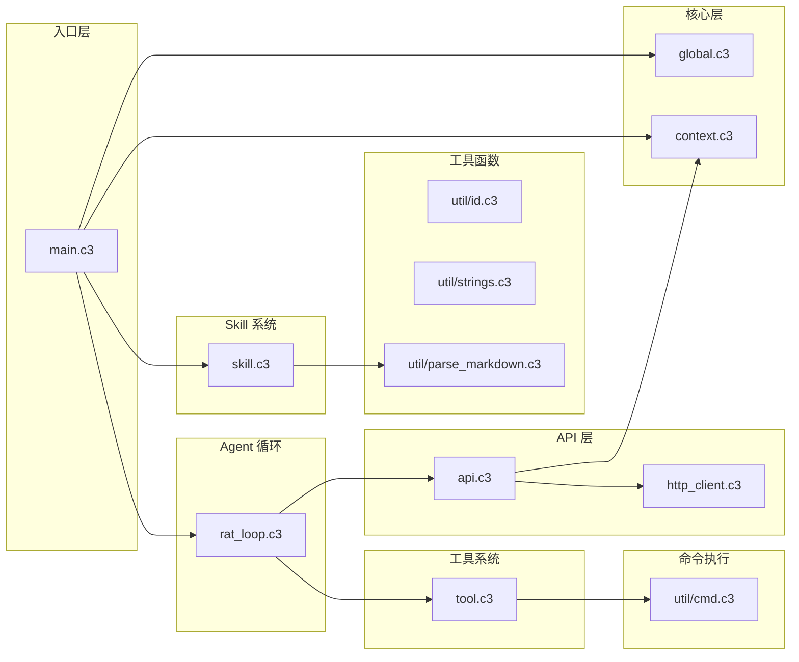

# 架构设计

## 模块说明

| 模块 | 文件 | 职责 |
| ---- | ---- | ---- |
| **入口层** | `src/main.c3` | 程序入口，解析 Flag，初始化 ToolHub/SkillHub/Context，启动 Agent 主循环 |
| **配置层** | `src/cli.c3`, `src/version.c3` | 命令行参数解析（Flag 结构体）、默认值管理、版本信息 |
| **全局状态** | `src/global.c3` | 线程本地存储（tlocal）的单例 GlobalStore，保存 `config_dir` / `log_file` / `debug` 标志，提供 `debug_log` 宏 |
| **核心层** | `src/context/context.c3` | Context/Message/ToolCall 等核心数据结构，系统提示词加载，消息列表管理 |
| **系统模板** | `src/context/system_prompt_template.md` | 系统提示词模板，支持 `{{cwd}}` / `{{date}}` / `{{os}}` 动态变量替换 |
| **API 层** | `src/api/api.c3` | OpenAI Chat Completions API 集成，请求序列化、HTTP 调用、响应解析 |
| **HTTP 层** | `src/api/http_client.c3` | HttpClient 封装 (GET/POST/request)，基于 `curl.c3l`，支持自定义 headers |
| **工具系统** | `src/tool/tool.c3` | ToolHub 调度中心、Tool 接口定义、按名称注册与分发 |
| **工具实现** | `src/tool/*_tool.c3`, `src/tool/*_schema.json` | 内置工具及其 JSON Schema：ReadFile, Bash, EditFile, WriteFile, Grep, Glob, ListDir, Task |
| **命令执行** | `src/util/cmd.c3` | 外部进程执行 (execute / execute_to_string)、CommandResult 封装、stdin 自动关闭 |
| **工具函数** | `src/util/id.c3`, `src/util/strings.c3`, `src/util/parse_markdown.c3` | 路径哈希、时间戳 ID、ANSI 字符串处理、Markdown + YAML frontmatter 解析 |
| **Skill 系统** | `src/skill.c3` | Skill/SkillHub 结构，从 `~/.agents/skills/` 和 `.agents/skills/` 查找并加载 SKILL.md |
| **Agent 循环** | `src/rat_loop.c3` | `run()` 主循环，支持交互模式与 headless 模式，工具调用调度，用户输入读取 |
| **外部依赖** | `lib/` | `curl.c3l` (libcurl 绑定), `cjson.c3l` (JSON 序列化/反序列化) |
| **预设 Agent** | `resources/agents/*.md` | 基于 oh-my-opencode-slim 二次开发的 Agent 定义（designer/explorer/fixer/librarian/oracle/orchestrator） |

## 数据流概览

```
┌─────────────┐      init       ┌──────────────┐
│  main.c3    │ ──────────────► │   Context    │
│  (入口)     │                 │  (核心状态)   │
└──────┬──────┘                 └──────┬───────┘
       │                               │
       │ run()                         │ messages[]
       ▼                               ▼
┌──────────────┐              ┌───────────────┐
│ rat_loop.c3  │ ◄──────────► │  api.c3       │
│ (Agent 循环)  │  completions │  (LLM 请求)   │
└──────┬──────┘              └───────┬───────┘
       │                             │
       │ do_dispatch()               │ HTTP POST
       ▼                             ▼
┌──────────────┐              ┌───────────────┐
│  ToolHub     │              │ http_client.c3│
│ (tool.c3)    │              │ (HTTP 封装)   │
└──────┬──────┘              └───────────────┘
       │
       ├─► ReadFileTool     ──► cmd::execute / file::load
       ├─► BashTool     ──► cmd::execute (sh -c)
       ├─► EditTool     ──► file::load / file::save
       ├─► WriteFileTool    ──► file::save
       ├─► GrepTool     ──► cmd::execute (rg)
       ├─► GlobTool     ──► cmd::execute (fd)
       ├─► ListDirTool       ──► cmd::execute (ls -ahl)
       └─► TaskTool     ──► cmd::execute (mp --headless ...)
```

## 架构图


```mermaid
flowchart LR
    subgraph Entry["入口层"]
        main["main.c3"]
    end

    subgraph Core["核心层"]
        ctx["context.c3"]
        global["global.c3"]
    end

    subgraph SkillSys["Skill 系统"]
        skill["skill.c3"]
    end

    subgraph Loop["Agent 循环"]
        run["rat_loop.c3"]
    end

    subgraph API["API 层"]
        completions["api.c3"]
        client["http_client.c3"]
    end

    subgraph Tools["工具系统"]
        hub["tool.c3"]
    end

    subgraph Cmd["命令执行"]
        exec_cmd["util/cmd.c3"]
    end

    subgraph Utils["工具函数"]
        id_mod["util/id.c3"]
        str_mod["util/strings.c3"]
        md_mod["util/parse_markdown.c3"]
    end

    main --> global
    main --> ctx
    main --> skill
    main --> run

    skill --> md_mod

    run --> completions
    run --> hub

    completions --> ctx
    completions --> client

    hub --> exec_cmd
```

## 关键设计说明

### 1. 全局状态管理 (`global.c3`)

使用 `tlocal GlobalStore` 实现线程级单例，避免在函数间透传 config_dir / log_file 等配置。`debug_log` 宏封装条件日志输出。

### 2. Skill 系统 (`skill.c3`)

- 搜索路径：`~/.agents/skills/*/SKILL.md`（全局）+ `.agents/skills/*/SKILL.md`（本地）
- 解析 YAML frontmatter，提取 `name` / `description` / `content`
- `SkillHub` 在初始化时全部加载到 `HashMap`，供系统提示词直接引用

### 3. Agent 循环模式 (`rat_loop.c3`)

| 模式 | 触发条件 | 行为 |
| ---- | -------- | ---- |
| **交互模式** | 默认 | `read_input()` 读取 stdin，支持多轮对话 |
| **Headless** | `--headless` | 从 `--task` 或 `--file` 读初始消息，完成一轮后自动退出 |
| **工具调用** | 回复含 `tool_call` | 自动 `do_dispatch()`，将工具结果作为 `role=tool` 消息追加 |

### 4. 输出截断保护 (BashTool)

Bash 工具执行输出超过 2000 行时自动截断，完整输出保存到 `config_dir/task_store/<id>_output.txt` 并在末尾追加文件路径提示。

### 5. Task 递归调用

`TaskTool` 通过 `cmd::execute(["mp", "--agent", name, "--headless", "-f", input, "-o", output])` 以子进程方式递归调用 `mp` 自身完成子任务。

### 6. Markdown + YAML Frontmatter 解析

`util/parse_markdown.c3` 解析 `---` 包围的 frontmatter 区块，支持 key:value 格式（值可带引号），用于 SKILL.md 元数据提取。
