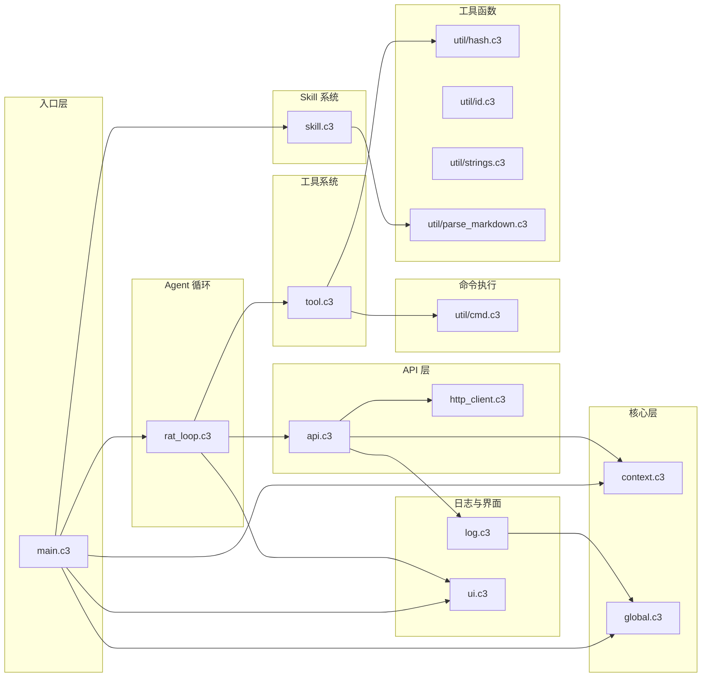

# 架构设计

## 模块说明

| 模块         | 文件                                              | 职责                                                                                          |
| ------------ | ------------------------------------------------- | --------------------------------------------------------------------------------------------- |
| **入口层**   | `src/main.c3`                                     | 程序入口，解析 Flag，初始化 ToolHub/SkillHub/Context，启动 Agent 主循环                       |
| **配置层**   | `src/cli.c3`, `src/version.c3`                    | 命令行参数解析（Flag 结构体）、默认值管理、版本信息                                           |
| **全局状态** | `src/global.c3`                                   | 线程本地存储（tlocal）的单例 GlobalStore，保存 `config_dir` / `log_file` / `debug` 标志       |
| **日志层**   | `src/log.c3`                                      | 分级日志宏（debug/info/warn/error），debug 受 `global::debug()` 控制，其余始终输出            |
| **UI 层**    | `src/ui.c3`                                       | 终端渲染（banner / 消息 / 提示符），NO_COLOR 环境变量支持，颜色与日志解耦                     |
| **核心层**   | `src/context/context.c3`                          | Context/Message/ToolCall 等核心数据结构，系统提示词加载，消息列表管理，导出 Markdown           |
| **系统模板** | `src/context/system_prompt_template.md`           | 系统提示词模板，支持 `{{cwd}}` / `{{date}}` / `{{os}}` / `{{toolsList}}` 动态变量替换         |
| **API 层**   | `src/api/api.c3`                                  | OpenAI Chat Completions API 集成，请求序列化、流式 SSE 响应解析、tool_call 增量分片累积       |
| **HTTP 层**  | `src/api/http_client.c3`                          | HttpClient 封装 (GET/POST/request)，基于 `curl.c3l`，支持自定义 headers                       |
| **工具系统** | `src/tool/tool.c3`                                | ToolHub 调度中心、Tool 接口定义、按名称注册与分发、schema 缓存                                 |
| **工具实现** | `src/tool/*_tool.c3`, `src/tool/*_schema.json`    | 内置工具及其 JSON Schema：ReadFile, Bash, EditFile, HashEditFile, WriteFile, Grep, Glob, ListDir, Task |
| **命令执行** | `src/util/cmd.c3`                                 | 外部进程执行 (execute / execute_to_string)、CommandResult 封装、stdin 自动关闭                 |
| **工具函数** | `src/util/hash.c3`                                | 行内容哈希（FNV-1a 32 位），生成 2 字符 hashline 锚点，用于 ReadFile 输出与 HashEditFile 校验 |
| **工具函数** | `src/util/id.c3`                                  | 时间戳 ID（`YYYYMMDD_HHMMSS`）、路径哈希                                                      |
| **工具函数** | `src/util/strings.c3`                             | 行尾归一化（`\r\n` → `\n`）、字符串填充                                                        |
| **工具函数** | `src/util/parse_markdown.c3`                      | Markdown + YAML frontmatter 解析，用于 SKILL.md 元数据提取                                     |
| **Skill 系统** | `src/skill.c3`                                  | Skill/SkillHub 结构，从 `~/.agents/skills/` 和 `.agents/skills/` 查找并加载 SKILL.md          |
| **Agent 循环** | `src/rat_loop.c3`                               | `run()` 主循环，支持交互模式与 headless 模式，工具调用调度，用户输入与斜杠命令读取             |
| **外部依赖** | `lib/`                                            | `curl.c3l` (libcurl 绑定), `cjson.c3l` (JSON 序列化/反序列化)                                  |
| **预设 Agent** | `resources/agents/*.md`                         | 基于 oh-my-opencode-slim 二次开发的 Agent 定义（designer/explorer/fixer/librarian/oracle/orchestrator） |

## 数据流概览

```
┌─────────────┐      init       ┌──────────────┐
│  main.c3    │ ──────────────► │   Context    │
│  (入口)     │                 │  (核心状态)   │
└──────┬──────┘                 └──────┬───────┘
       │                               │
       │ run()                         │ messages[]
       ▼                               ▼
┌──────────────┐              ┌───────────────┐
│ rat_loop.c3  │ ◄──────────► │  api.c3       │
│ (Agent 循环)  │  completions │  (LLM 请求)   │
└──────┬──────┘              └───────┬───────┘
       │                             │
       │ do_dispatch()               │ HTTP POST (streaming SSE)
       ▼                             ▼
┌──────────────┐              ┌───────────────┐
│  ToolHub     │              │ http_client.c3│
│ (tool.c3)    │              │ (HTTP 封装)   │
└──────┬──────┘              └───────────────┘
       │
       ├─► ReadFileTool      ──► file::load + util::line_hash
       ├─► BashTool          ──► cmd::execute (sh -c)
       ├─► EditTool          ──► file::load / file::save
       ├─► HashEditFileTool  ──► file::load + util::line_hash / file::save
       ├─► WriteFileTool     ──► file::save
       ├─► GrepTool          ──► cmd::execute (rg)
       ├─► GlobTool          ──► cmd::execute (fd)
       ├─► ListDirTool       ──► cmd::execute (ls -ahl)
       └─► TaskTool          ──► cmd::execute (mp --headless ...)
```

## 架构图


```mermaid
flowchart LR
    subgraph Entry["入口层"]
        main["main.c3"]
    end

    subgraph Core["核心层"]
        ctx["context.c3"]
        global["global.c3"]
    end

    subgraph LogUI["日志与界面"]
        log["log.c3"]
        ui["ui.c3"]
    end

    subgraph SkillSys["Skill 系统"]
        skill["skill.c3"]
    end

    subgraph Loop["Agent 循环"]
        run["rat_loop.c3"]
    end

    subgraph API["API 层"]
        completions["api.c3"]
        client["http_client.c3"]
    end

    subgraph Tools["工具系统"]
        hub["tool.c3"]
    end

    subgraph Cmd["命令执行"]
        exec_cmd["util/cmd.c3"]
    end

    subgraph Utils["工具函数"]
        hash_mod["util/hash.c3"]
        id_mod["util/id.c3"]
        str_mod["util/strings.c3"]
        md_mod["util/parse_markdown.c3"]
    end

    main --> global
    main --> ctx
    main --> skill
    main --> run
    main --> ui

    skill --> md_mod

    run --> completions
    run --> hub
    run --> ui

    completions --> ctx
    completions --> client
    completions --> log

    hub --> exec_cmd
    hub --> hash_mod

    log --> global
```

## 关键设计说明

### 1. 全局状态管理 (`global.c3`)

使用 `tlocal GlobalStore` 实现线程级单例，避免在函数间透传 config_dir / log_file 等配置。`log::debug` 宏通过 `global::debug()` 判断是否输出。

### 2. Skill 系统 (`skill.c3`)

- 搜索路径：`~/.agents/skills/*/SKILL.md`（全局）+ `.agents/skills/*/SKILL.md`（本地，基于 cwd）
- 解析 YAML frontmatter，提取 `name` / `description`，正文作为 `content`
- `SkillHub` 在初始化时全部加载到 `HashMap`，系统提示词中以 XML 形式列出已安装 skill 的名称、描述与路径
- 名称、描述、正文三者均非空才算合法 skill

### 3. Agent 循环模式 (`rat_loop.c3`)

| 模式          | 触发条件                  | 行为                                                                                |
| ------------- | ------------------------- | ----------------------------------------------------------------------------------- |
| **交互模式**  | 默认                      | `read_input()` 读取 stdin，支持多轮对话；处理 `/export`、`/clear`、`/exit` 斜杠命令 |
| **Headless**  | `--headless`              | 从 `--task` 或 `--task-file` 读初始消息，完成一轮对话后自动退出                     |
| **工具调用**  | 回复含 `tool_calls`       | 逐个 `do_dispatch()`，将工具结果作为 `role=tool` 消息追加，全部完成后再请求模型     |

工具调用采用游标（`tool_call_cursor`）逐个执行当前 assistant 消息中的 tool_call，避免并发问题。

### 4. 流式 SSE 响应解析 (`api.c3`)

- 请求固定带 `"stream": true`，并设置 `thinking.type = "enabled"` 开启思考链
- HttpClient 将整个响应体累积进 DString 后一次性返回，`read_stream_to_message` 解析完整 SSE 文本
- `tool_calls` 以增量分片下发，按 `index` 分组累积 `arguments`，支持单次回复中的多个 tool_call
- `content` 与 `reasoning_content` 分别累积
- 结束标记为 `data: [DONE]`

### 5. hashline 锚点机制 (`util/hash.c3`)

- ReadFile 输出每行为 `line:hash|content` 格式
- `line_hash` 使用 FNV-1a 32 位哈希，取最低字节拆成两个 4-bit nibble，映射到 `ZPMQVRWSNKTXJBYH` 字母表，得到 2 字符锚点
- 无字母数字的行（空行、`{`、`}` 等）额外把 1-based 行号折叠进哈希状态，保证不同位置的同构行得到不同锚点
- HashEditFile 通过 `line` + `hash` 锚定行，写入前原子校验全部锚点，任一过期即整体拒绝

### 6. 输出截断保护

- BashTool：执行输出超过 2000 行时自动截断（保留最后 2000 行），完整输出保存到 `<config_dir>/task_store/<id>_output.txt` 并在末尾追加文件路径提示
- TaskTool：子 agent 的输入与输出分别保存到 `<config_dir>/task_store/<id>_input.txt` 与 `<id>_output.txt`

### 7. Task 递归调用

`TaskTool` 通过 `cmd::execute(["mp", "--agent", name, "--headless", "-f", input, "-o", output])` 以子进程方式递归调用 `mp` 自身完成子任务，子 agent 在干净的 Context 中运行，完成后将输出文件内容返回给父 agent。

### 8. Markdown + YAML Frontmatter 解析 (`util/parse_markdown.c3`)

解析 `---` 包围的 frontmatter 区块，支持 `key:value` 格式（值可带引号并自动反转义），用于 SKILL.md 元数据提取。frontmatter 之外的正文作为 body。

### 9. 系统提示词装配 (`context.c3`)

`Context.reset()` 在每次会话开始（或 `/clear`）时重新装配系统提示词，按顺序拼接：

1. `system_prompt_template.md` 渲染结果（替换 `{{cwd}}` / `{{date}}` / `{{os}}` / `{{toolsList}}`）
2. 若当前目录存在 `AGENTS.md`，以 `<project_context>` XML 包裹注入
3. 若 SkillHub 非空，附加已安装 skill 列表

### 10. UI 与颜色解耦 (`ui.c3`)

遵循 [NO_COLOR 约定](https://no-color.org)：环境变量 `NO_COLOR` 存在且非空时禁用颜色，退化为纯文本。颜色输出集中在 ui 层，日志层（`log.c3`）不带颜色。
