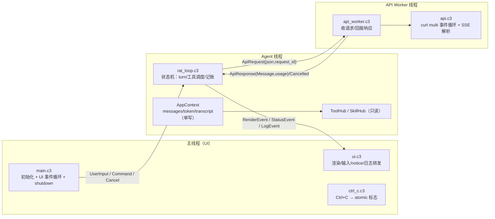
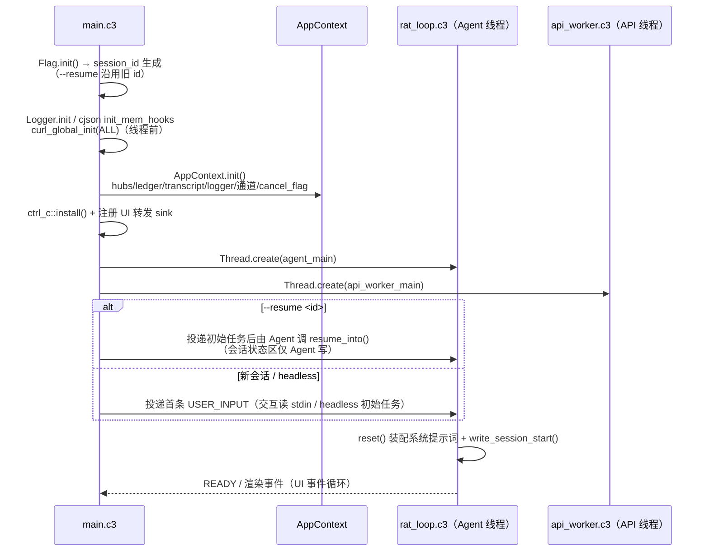
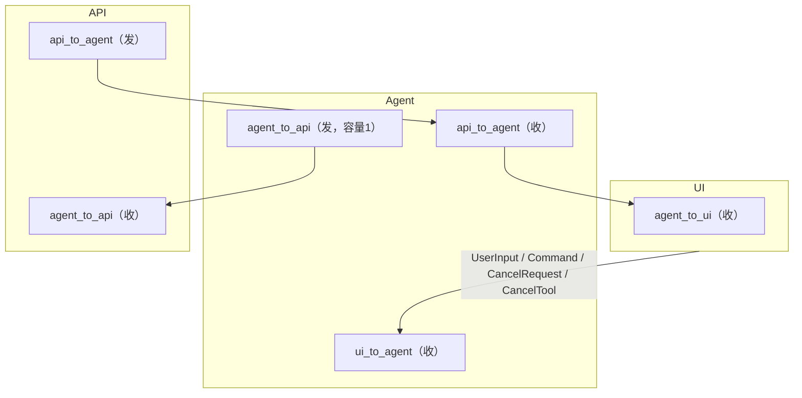
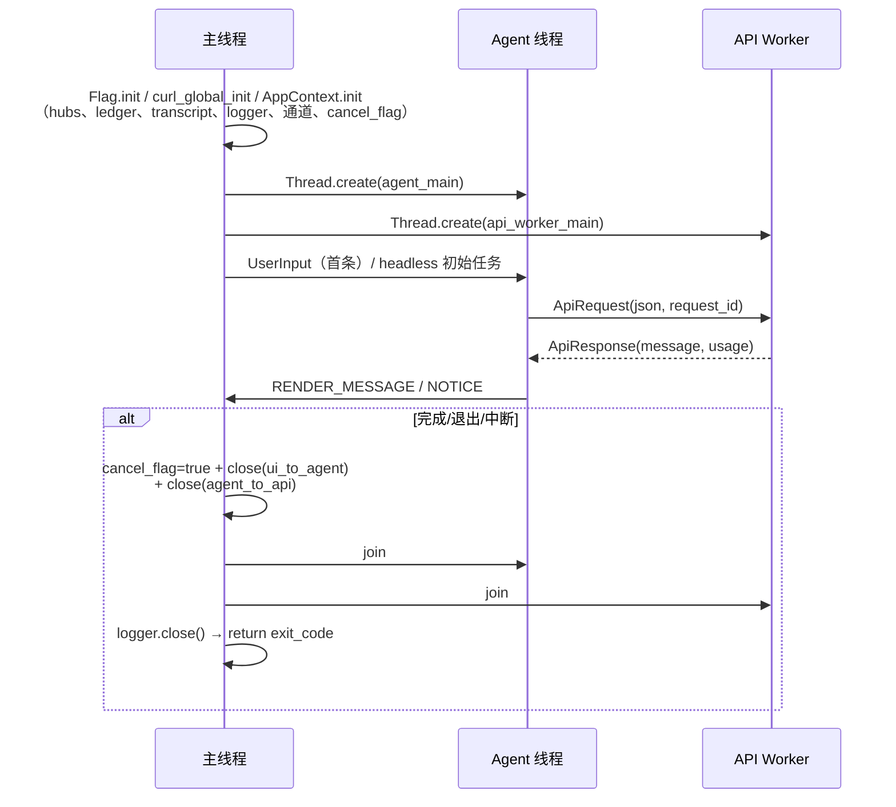
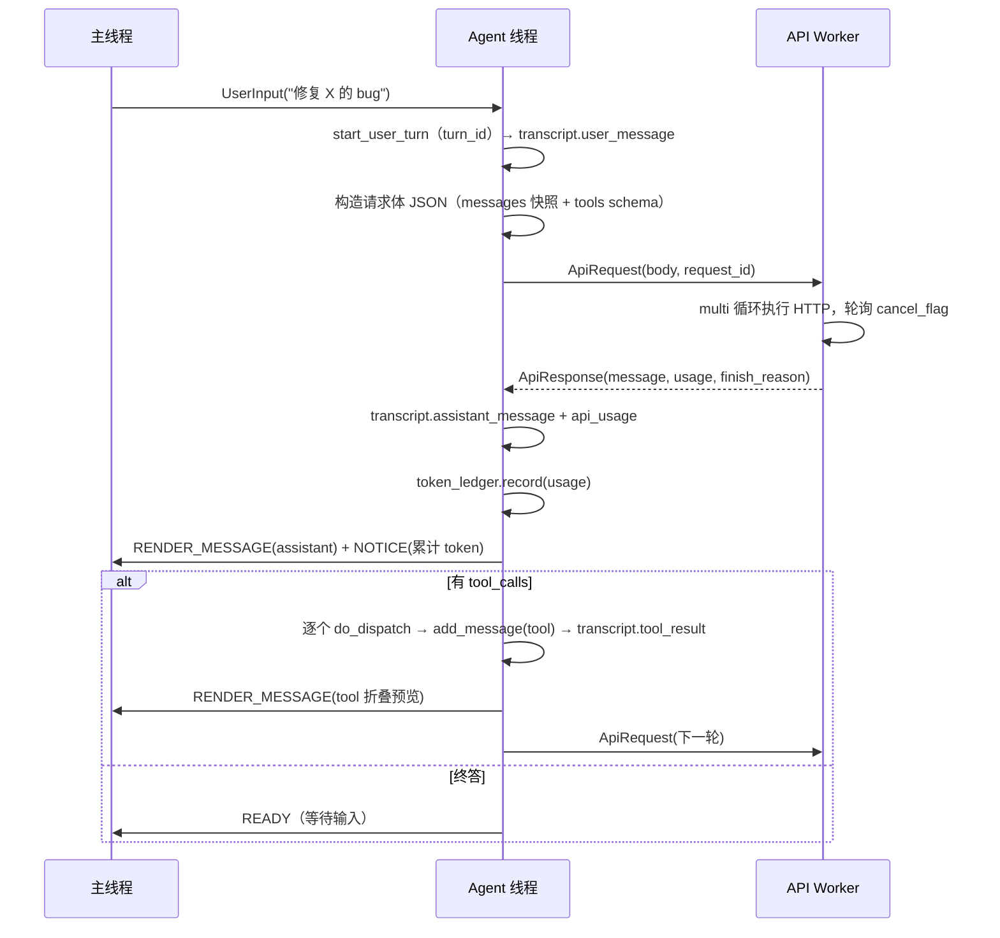
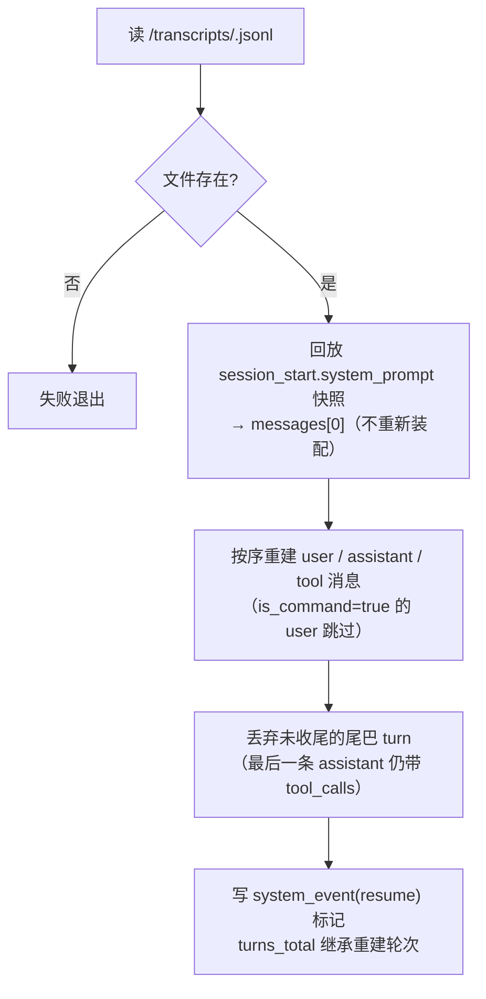
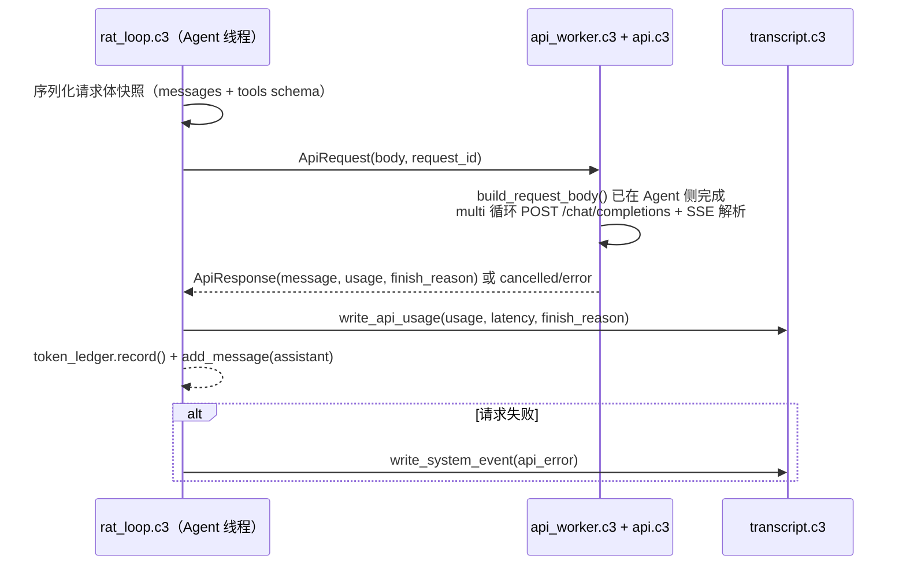

# 架构设计

> 面向开发者。版本对齐 `project.json`（当前 **2.0.0**）。
> 演进方案与设计决议见 [arch-next.md](arch-next.md) / [arch-next-spec.md](arch-next-spec.md)；记录格式规范见 [transcript.md](transcript.md)；CLI 见 [flags.md](flags.md)。
> 与 v1（单线程）的差异是**架构分水岭**：统一 `AppContext` + 三线程可中断；对外行为（CLI、transcript schema、`--resume`、Task 子代理、hashline/HashEditFile）保持兼容。

## 1. 总览

`mp` 是一个用 C3 实现的命令行 coding agent：一个 **Agent Loop** 反复调用 OpenAI 兼容的 Chat Completions API，把模型产生的 `tool_calls` 逐个分发给内置工具执行，结果回填消息历史后继续请求，直到模型给出最终答复。

v2 相比 v1 的核心改造：

- **统一 AppContext**：配置、会话状态、工具/技能 hub、token 账本、transcript、日志、取消信号统一挂载在一个对象上，一处初始化、一处持有、按所有权分区访问。删除 v1 散落五处的 tlocal 全局单例（`global.c3` 已删除）。
- **三线程模型**：UI/UX 在主线程，Agent loop 独立线程，API 调用独立 worker 线程。核心收益是 **Ctrl+C 可中断**——进行中的 HTTP 请求被干净取消，长工具执行可杀子进程，进程保持存活回到输入提示。
- **Token 账本与预算**：会话级累计（prompt/completion/reasoning），可配置上下文窗口上限与软/硬阈值，超软阈值告警。
- **可审计可恢复**：每会话一份 JSONL transcript，记录每一步推理、工具调用与 token 成本；支持 `--resume` 断点续跑。全部事件只在 Agent 线程写（无需锁）。

设计目标：

- **原生轻量**：单可执行文件 + libcurl 动态库；工具层大部分用外部 CLI（rg/fd/sh）或纯 C3 实现。
- **编辑可靠性**：以 `line:hash` 哈希锚点替代大段旧文本匹配，配合批量原子校验，杜绝工具并发修改导致的误编辑。
- **兼容性**：只依赖 OpenAI Chat Completions 协议子集（流式 SSE + tools + reasoning），可用任意兼容服务（DeepSeek / vLLM / LiteLLM 等）。


```mermaid
flowchart LR
    subgraph MT["主线程（UI）"]
        m_main["main.c3<br/>初始化 + UI 事件循环 + shutdown"]
        m_ui["ui.c3<br/>渲染/输入/notice/日志转发"]
        m_sig["ctrl_c.c3<br/>Ctrl+C → atomic 标志"]
    end

    subgraph AT["Agent 线程"]
        a_loop["rat_loop.c3<br/>状态机：turn/工具调度/记账"]
        a_ctx["AppContext<br/>messages/token/transcript（单写）"]
        a_hub["ToolHub / SkillHub（只读）"]
    end

    subgraph AW["API Worker 线程"]
        w_http["api.c3<br/>curl multi 事件循环 + SSE 解析"]
        w_req["api_worker.c3<br/>收请求/回报响应"]
    end

    m_main -- "UserInput / Command / Cancel" --> a_loop
    a_loop -- "RenderEvent / StatusEvent / LogEvent" --> m_ui
    a_loop -- "ApiRequest(json,request_id)" --> w_req
    w_req -- "ApiResponse(Message,usage)/Cancelled" --> a_loop

    a_ctx --> a_hub
    w_req --> w_http
```

> 关键点：`AppContext` 是**单写者多读者**结构——可变状态（messages、token、turns、active_request_id、transcript 事件）只有 Agent 线程写；UI 与 API worker 只通过通道收发**消息副本**。共享可变原语共四处：`atomic cancel_flag`（请求取消）、`atomic g_current_child_handle`（L2 杀子进程，Agent 单写 / UI 读）、`atomic g_ctrl_c`（Ctrl+C handler 单写 / 主循环读）与 `Logger` 内部 mutex（保护文件句柄）。另有一个写一次后只读的全局 `g_notice_sink/g_notice_ctx`（控制台 sink 回调转发，无竞争）。

## 2. 目录结构

```sh
src/
  main.c3                   # 入口：Flag 解析、AppContext 初始化、线程创建、UI 事件循环、shutdown
  cli.c3                    # Flag 结构体与命令行解析（默认值、帮助文本）
  rat_loop.c3               # Agent 线程主循环（显式状态机 + 工具游标调度 + transcript 事件写入点）
  message.c3                # Message/ToolCall 类型与生命周期（叶子模块，无项目依赖）
  skill.c3                  # SkillHub：扫描 ~/.agents/skills 与 .agents/skills
  transcript.c3             # TranscriptWriter：对象化，全部事件只在 Agent 线程写
  log.c3                    # Logger 对象化（mutex + 文件 sink + 控制台 sink 转发）
  ui.c3                     # banner / render_event / read_input / notice；NO_COLOR
  version.c3                # 版本号（非 RELEASE 硬编码 2.0.0；RELEASE 由 scripts/version.sh 注入）
  app/
    app.c3                  # AppContext：定义、init、所有权分区、reset/start_new_session
    event.c3                # 事件类型与通道负载（UiEvent / UiOutEvent / ApiRequest / ApiResponse）
    prompt_assembly.c3      # 系统提示词装配（纯函数，并入 app 模块）
    token_ledger.c3         # TokenLedger（新增）：累计 + 预算判定
    system_prompt_template.md      # {{cwd}}/{{date}}/{{os}} 占位模板
    behavioral_guideline_template.md  # 行为准则注入
    tools_memo_template.md      # 注入系统提示词的工具使用规范
  api/
    api.c3                  # 请求体构造 + SSE 解析 + curl multi 事件循环（execute_api_request）
    api_worker.c3           # API worker 主循环（收 ApiRequest → 回报 ApiResponse）
    http_client.c3          # easy handle 装配（供 multi 复用）
  tool/
    tool.c3                 # Tool 接口、ToolHub（注册/schema_cache 预计算/do_dispatch）
    common.c3               # load_store_dir()：<config_dir>/task_store
    read_file_tool.c3       # ReadFile：hashline 输出 + offset/limit
    hash_edit_tool.c3       # HashEditFile：哈希锚点原子编辑（核心特色）
    write_file_tool.c3      # WriteFile：创建/覆盖
    bash_tool.c3            # Bash：sh -c，2000 行截断 + 完整输出落盘
    grep_tool.c3            # Grep：rg 封装
    glob_tool.c3            # Glob：fd 封装
    list_dir_tool.c3        # ListDir：纯 C3 实现（不调外部 ls）
    task_tool.c3            # Task：spawn mp 子进程 + MP_PARENT_SESSION 注入
    *_schema.json           # 各工具 JSON Schema（$embed 编译期内嵌）
  util/
    cmd.c3                  # execute()/execute_to_string()：进程 spawn、关 stdin、合并 stderr；kill_current_child()
    hash.c3                 # line_hash()：FNV-1a 32 位 → 2 字符锚点
    id.c3                   # timestamp()/timestamp_id()/hash_path()
    strings.c3              # normalize_line_endings()/pad_start()
    parse_markdown.c3       # parse_markdown()：Markdown + YAML frontmatter
    input.c3                # stdin_has_data()：非阻塞输入轮询（替代 readline，配合 Ctrl+C）
    ctrl_c.c3               # Ctrl+C 捕获（SetConsoleCtrlHandler / SIGINT handler，只置 atomic）
resources/
  agents/*.md               # 6 个预设 agent
  skills/prd/SKILL.md       # 内置 skill
  error_responses/*.json    # 错误响应样本
lib/                        # cjson.c3l、curl.c3l
test/                       # 单元测试（80 个，含进程级集成与中断注入）
scripts/                    # release.sh / install.sh / version.sh / build_cjson_lib.sh
docs/                       # arch / arch-next / arch-next-spec / flags / config / transcript / c3-intro / update-libcurl
```

> `global.c3` 已删除：`log`/`transcript` 的初始化参数改由 `AppContext`/main 显式传入；`log::set_default()` 仅作兼容别名桥。各工具 schema 通过 `$embed` 编译期内嵌，不在运行时装配。

## 3. 启动流程


```mermaid
sequenceDiagram
    participant main as main.c3
    participant ctx as AppContext
    participant agent as rat_loop.c3（Agent 线程）
    participant api as api_worker.c3（API 线程）

    main->>main: Flag.init() → session_id 生成<br/>（--resume 沿用旧 id）
    main->>main: Logger.init / cjson init_mem_hooks<br/>curl_global_init(ALL)（线程前）
    main->>ctx: AppContext.init()<br/>hubs/ledger/transcript/logger/通道/cancel_flag
    main->>main: ctrl_c::install() + 注册 UI 转发 sink
    main->>agent: Thread.create(agent_main)
    main->>api: Thread.create(api_worker_main)
    alt --resume <id>
        main->>agent: 投递初始任务后由 Agent 调 resume_into()<br/>（会话状态区仅 Agent 写）
    else 新会话 / headless
        main->>agent: 投递首条 USER_INPUT（交互读 stdin / headless 初始任务）
    end
    agent->>agent: reset() 装配系统提示词 + write_session_start()
    agent-->>main: READY / 渲染事件（UI 事件循环）
```

要点：

- `session_id` 由 `util::timestamp_id()`（本地时间 `YYYYMMDD_HHMMSS`）生成，前缀 `ses_`；`--resume` 时沿用被恢复会话的 id，transcript 继续追加同一文件。
- `curl_global_init(CurlGlobal.ALL)` 必须在创建任何线程前、在 main 显式调用一次（多线程下 libcurl 硬要求）。
- 系统提示词由 `context::build_system_prompt()` 装配（原 `Context.reset()` 职责，已抽出为可重入函数）：`system_prompt_template.md` 渲染（替换 `{{cwd}}/{{date}}/{{os}}`）→ 追加 `behavioral_guideline_template.md` → 追加工具列表与 `tools_memo_template.md` → 追加 `AGENTS.md`（`<project_instructions>`）→ 追加已安装 skill 列表。产物存入 `AppContext.system_prompt_snapshot`，`session_start` 事件直接引用。

## 4. 核心设计 A：统一 AppContext

### 4.1 结构（`src/app/app.c3`）

```c3
struct AppContext
{
    // ---- 配置区（初始化后只读）----
    Flag flag;                    // Flag 拷贝（不再传 Flag*）
    Allocator allocator;          // &allocators::LIBC_ALLOCATOR（堆），非 tmem
    Path cwd;
    Path config_dir;

    // ---- 会话状态区（仅 Agent 线程写）----
    String session_id;
    String active_request_id;     // Task 父 request_id 来源（Agent 单写）
    List{Message} messages;
    int turns_total;
    DateTime started_at;
    DateTime updated_at;
    bool resumed;

    // ---- 资源区（初始化后只读）----
    ToolHub* tool_hub;
    SkillHub* skill_hub;
    String system_prompt_snapshot;  // 装配产物（session_start/resume 用）
    String tools_schema_json;       // schema_cache 预计算产物

    // ---- 子系统区 ----
    TokenLedger* token_ledger;
    TranscriptWriter* transcript;
    Logger* logger;

    // ---- 运行时信号区（三线程拓扑）----
    UnboundedChannel{UiEvent}* ui_to_agent;      // ui → agent（unbounded）
    UnboundedChannel{UiOutEvent}* agent_to_ui;   // agent → ui（unbounded）
    BufferedChannel{ApiRequest}* agent_to_api;   // agent → api（容量 1，背压）
    UnboundedChannel{ApiResponse}* api_to_agent; // api → agent（unbounded）
    Atomic{bool}* cancel_flag;                   // Ctrl+C 取消信号
    Thread agent_thread;
    Thread api_thread;
}
```

### 4.2 所有权与线程分区

| 字段组 | 写者 | 读者 | 同步机制 |
| --- | --- | --- | --- |
| flag / hubs / schema / system_prompt_snapshot | main（启动期） | 所有线程 | 无（初始化后只读） |
| messages / turns_total / session_id / active_request_id | Agent | Agent（API 请求构造也在 Agent 内做快照） | 无 |
| token_ledger | Agent | UI（经事件） | 无（UI 只读事件携带的副本） |
| transcript | Agent | — | 无（写点唯一，见 §8） |
| logger 文件句柄 | 任意线程 | — | 内部 mutex |
| cancel_flag | 任意线程 set | API worker / Agent / 主循环轮询 | atomic |
| g_current_child_handle | Agent（工具执行期） | UI（L2 杀子进程） | atomic |
| g_ctrl_c | Ctrl+C handler | 主循环 | atomic |
| g_notice_sink / g_notice_ctx | main（启动期） | 非主线程日志转发 | 无（初始化后只读） |

### 4.3 子系统对象化明细

#### TokenLedger（`src/app/token_ledger.c3`）

```c3
struct TokenUsage { long prompt_tokens; long completion_tokens; long reasoning_tokens; }
struct TokenLedger
{
    TokenUsage session_total;      // 会话累计
    TokenUsage turn_total;         // 当前 turn 累计（begin_turn 清零）
    TokenUsage last_request;       // 最近一次请求
    List{UsageRecord} history;     // 最近 32 条明细（供 UI 状态行/告警）
    long context_window_limit;     // 上下文窗口上限（0 = 不启用）
    double soft_ratio;             // 软阈值（默认 0.8）
    double hard_ratio;             // 硬阈值（默认 0.95）
}
fn void record(&self, String request_id, TokenUsage usage);
fn BudgetVerdict check_budget(&self);  // OK / WARN / EXCEEDED
```

- 数据流：API worker 回报 usage → Agent 调 `record()` 并写 `api_usage` 事件。
- 预算判定：`context_window_limit == 0` 恒为 `OK`；否则以 `estimated_prompt_tokens()`（= 会话累计总 token，作为上下文占用的近似上界）与 limit 比值对照软/硬阈值。`WARN` → `system_event(token_warning)` + UI 状态行提示；`EXCEEDED` → 拒绝继续请求（compaction 预留，v2 仅实现到 WARN 的落盘与展示）。
- 新增 CLI：`--max-tokens <n>`（0 = 不启用）。

#### TranscriptWriter（`src/transcript.c3` 重构）

- `TranscriptWriter { Allocator allocator; String session_id; bool enabled; }`，方法签名不再散传 session_id；**全部调用点只在 Agent 线程**（UI 线程把输入/命令事件经通道转交 Agent 落盘）。
- 事件 schema 不变（v1），新增两个 `system_event` subtype（additive，兼容旧 resume）：`request_cancelled`（含 request_id、已消耗 latency、是否有部分内容）、`tool_cancelled`。
- `--no-transcript` 时 writer 内部全 no-op，与现在一致。

#### Logger（`src/log.c3` 重构）

- `Logger { File? log_file; Mutex mu; LogLevel level; LogSink console_sink; }`。
- 两级设计：**文件 sink 任意线程可写**（mutex + 单次写入 + flush，行完整）；**控制台 sink 只走主线程**——非 UI 线程的日志转成 `LogEvent` 经 `forward_log_event` 投递 UI 通道，由主线程统一打印，保证不交错。
- 日志格式（`[时间戳] [级别] 消息`）与级别→流映射（info→stdout，其余→stderr）保持不变。

#### ToolHub / SkillHub

- `ToolHub.init()` 时预计算 `schema_cache`（`tools_schema_json`，写入 `AppContext`）与工具名列表；`do_dispatch()` 仍在 Agent 线程内**串行**执行（永久串行，OQ-2 已定）。
- `TaskTool` 的父 request_id 从 `AppContext.active_request_id` 读取（Agent 线程持有，无 tlocal）；`skill.c3` 预留的全局变量已删除。
- hub 初始化后只读访问、schema 预计算，无锁。

#### PromptAssembly（`src/app/prompt_assembly.c3`）

- 系统提示词装配抽出为可重入函数：`/clear` 时重新装配；`--resume` 时用快照不重装；产物存入 `system_prompt_snapshot`。`Context` 结构体本身合并进 `AppContext`；`Message`/`ToolCall` 类型独立为叶子模块 `src/message.c3`（避免 app↔transcript 循环 import）。

### 4.4 跨线程内存规则

| 规则 | 说明 |
| --- | --- |
| R1 | `AppContext.allocator = &allocators::LIBC_ALLOCATOR`（项目需开 `LIBC` feature）；`messages` 及其中全部 String/ToolCall 用该 allocator |
| R2 | 跨线程通道负载（UiEvent/UiOutEvent/ApiRequest/ApiResponse）一律 heap 分配，接收方处理完显式释放 |
| R3 | `tmem` 仅限线程内短生命周期临时值；绝不放入消息、通道负载或 AppContext。**新线程须 `@pool_init`**（否则 panic） |
| R4 | `cjson` 实例不跨线程：SSE 解析在 API worker（自己的树），工具参数解析在 Agent（自己的树）；`init_mem_hooks` 在 main 调用一次 |
| R5 | 线程结束前释放其持有的堆分配（c3c test 的泄漏检测对多线程同样生效） |
| R6 | 传给 C 函数（curl 等）的字符串必须 NUL 结尾（`string::format`/`zstr_copy`）；`string::tformat` 返回值不保证 NUL 结尾（曾导致 curl 414） |

## 5. 核心设计 B：三线程模型

### 5.1 三线程职责

| 线程 | 模块 | 职责 | 禁止 |
| --- | --- | --- | --- |
| **主线程（UI）** | main / ui / ctrl_c | `AppContext` 初始化与所有权；stdin 读输入（交互模式）；事件循环：RenderEvent 渲染、LogEvent 打印、StatusEvent/Notice；Ctrl+C 捕获置 `cancel_flag`；shutdown 协调与 join | 直接读写 messages/token/transcript；直接调 API |
| **Agent 线程** | rat_loop / tool / transcript / token_ledger | 显式状态机（turn 管理、工具游标调度、消息装配、构造请求体快照、transcript 全部事件写入、token 记账、`/clear` `/export` 处理） | 阻塞等待 stdin；直接执行 HTTP |
| **API Worker 线程** | api / api_worker / http_client | 收 `ApiRequest` → curl multi 事件循环执行 → SSE 解析为 Message → 回传 `ApiResponse`；轮询 `cancel_flag` 支持取消 | 读 messages；写 transcript（usage 由 Agent 落盘） |

### 5.2 通道拓扑（`std::threads::channel`）


```mermaid
flowchart TD
    subgraph UI
        ui_ev["agent_to_ui（收）"]
    end
    subgraph Agent
        a_in["ui_to_agent（收）"]
        a_api["agent_to_api（发，容量1）"]
        a_resp["api_to_agent（收）"]
    end
    subgraph API
        w_in["agent_to_api（收）"]
        w_out["api_to_agent（发）"]
    end

    UI -->|UserInput / Command / CancelRequest / CancelTool| a_in
    a_api --> w_in
    w_out --> a_resp
    a_resp --> ui_ev
```

事件类型（`src/app/event.c3`）：

```c3
// ui → agent（unbounded）
enum UiEventType { USER_INPUT, COMMAND_CLEAR, COMMAND_EXPORT, COMMAND_EXIT,
                   COMMAND_USAGE, CANCEL_REQUEST, CANCEL_TOOL }
struct UiEvent { UiEventType type; String text; }   // text: heap

// agent → ui（unbounded）
enum UiOutKind { RENDER_MESSAGE, NOTICE, LOG_LINE, READY, SHUTDOWN }
struct UiOutEvent { UiOutKind kind; Message* msg; String tool_name; String text;
                    bool to_stderr; int exit_code; }

// agent → api（buffered，容量 1）与 api → agent（unbounded）
struct ApiRequest { String request_id; String body_json; String url; List{String} headers; }
struct ApiResponse { String request_id; Message* message; Usage usage; bool has_usage;
                     String finish_reason; String error_detail; bool cancelled;
                     long latency_ms; bool has_partial_content; }
```

选型理由：

- `unbounded`：UI 事件与 API 响应（生产速率不可控），避免背压死锁；
- `buffered`（容量 1）：Agent 一次只投一个请求，天然背压；
- `close()` 作为 shutdown 信号：阻塞 `pop()` 先排空队列剩余元素，随后返回 `CHANNEL_CLOSED` fault（非 null）。

### 5.3 生命周期（shutdown 协议）


```mermaid
sequenceDiagram
    participant M as 主线程
    participant A as Agent 线程
    participant W as API Worker

    M->>M: Flag.init / curl_global_init / AppContext.init<br/>（hubs、ledger、transcript、logger、通道、cancel_flag）
    M->>A: Thread.create(agent_main)
    M->>W: Thread.create(api_worker_main)
    M->>A: UserInput（首条）/ headless 初始任务
    A->>W: ApiRequest(json, request_id)
    W-->>A: ApiResponse(message, usage)
    A->>M: RENDER_MESSAGE / NOTICE
    alt 完成/退出/中断
        M->>M: cancel_flag=true + close(ui_to_agent)<br/>+ close(agent_to_api)
        M->>A: join
        M->>W: join
        M->>M: logger.close() → return exit_code
    end
```

- `/exit`、headless 完成、Ctrl+C 全部汇聚到 SHUTDOWN（close 输入通道 → `CHANNEL_CLOSED` → 收尾 → join）。三种退出路径均无 hang、无孤儿线程。

### 5.4 Agent 线程状态机（`src/rat_loop.c3`）

Agent 线程生命周期 = 整个会话，线程函数内部是**状态机驱动的 while 循环**（OQ-7 已定 A）。v1 的隐式状态升级为显式 enum：

```c3
enum AgentState { IDLE, AWAITING_API, EXECUTING_TOOLS, CANCELLING, SHUTDOWN }
```

状态迁移表（中断正确性的显式规则）：

| 状态 | 事件 | 下一状态 | 动作 |
| --- | --- | --- | --- |
| IDLE | UserInput | AWAITING_API | `start_user_turn` + 构造请求体快照 + 投递 |
| IDLE | `/clear` 命令 | IDLE | 旧会话收尾(interrupted) + 新 session + 重装配 prompt |
| IDLE | `/exit` 命令 / 通道关闭 | SHUTDOWN | 写 session_end |
| AWAITING_API | 响应无 tool_calls | IDLE | 终答渲染 |
| AWAITING_API | 响应有 tool_calls | EXECUTING_TOOLS | 记游标 |
| AWAITING_API | cancelled（L1） | CANCELLING | 写 system_event(request_cancelled) |
| AWAITING_API | API 错误 | IDLE（交互）/ SHUTDOWN（headless） | 同 v1 语义 |
| EXECUTING_TOOLS | 还有未执行 tool_call | EXECUTING_TOOLS | 串行 do_dispatch 下一个 |
| EXECUTING_TOOLS | 全部执行完 | AWAITING_API | 再请求 |
| EXECUTING_TOOLS | 工具中断（L2） | CANCELLING | 杀子进程 + system_event(tool_cancelled) |
| CANCELLING | 清理完成 | IDLE | 丢弃半成品 turn（OQ-3） |

- **不是忙等**：两个阻塞点都在通道 `pop()` 上（等 UI 输入 / 等 API 响应），空闲时零 CPU。
- **线程常驻**（非每 turn 建线程）：turn 状态（`turn_id` / `tool_call_cursor` / `pending_assistant_idx`）留在状态机局部变量，是「messages/token/transcript 由 Agent 单写、无需锁」的前提。
- **退出路径唯一**：`/exit`、headless 完成、Ctrl+C 全部汇聚到 SHUTDOWN。

## 6. 核心设计 C：中断支持

### 6.1 Ctrl+C 捕获（`src/util/ctrl_c.c3`）

- **Windows**：`SetConsoleCtrlHandler`（kernel32）extern 声明（3 行），handler 内**只做一件事**：`g_ctrl_c.store(true)`（atomic store 在信号 handler 中安全），返回 TRUE 阻止默认终止。
- **POSIX**：`std::os::posix::install_signal_handler(SIGINT, handler)` 同上。
- 主循环轮询 `ctrl_c::pressed()`（读取后复位），按 Agent 当前状态分流（见 §6.3）。handler 只能触碰 atomic——Windows 回调运行在独立线程、POSIX 信号可能打断任意线程。

### 6.2 API 请求取消协议（curl multi，`src/api/api.c3`）

`execute_api_request()` 已实现为 worker 内 multi 事件循环：

```c3
Curl* easy = curl::easy_init();
// ...setopt（URL/WRITEFUNCTION/POSTFIELDS 等，同原 http_client）...
CurlM* multi = curl::multi_init();
curl::multi_add_handle(multi, easy);
while (true)
{
    int running = 0;
    curl::multi_poll(multi, null, 0, 100, &running);   // 100ms 取消检查窗口
    curl::multi_perform(multi, &running);
    if (cancel_flag != null && cancel_flag.load()) { /* cancelled */ break; }
    if (running == 0) break;                            // 正常完成
}
// multi_info_read 取 CURLMSG_DONE → easy_getinfo(RESPONSE_CODE)
```

- 取消延迟上限 = 100ms（poll 超时），`multi_wakeup()` 可立即唤醒。
- SSE 解析逻辑（`read_stream_to_message`）原样在 worker 线程运行，不改行为。
- worker 回报 `ApiResponse{cancelled=true, has_partial_content, latency_ms}`，Agent 据此丢弃半成品 turn。

### 6.3 中断语义分级

| 级别 | 触发 | 行为 | 状态 |
| --- | --- | --- | --- |
| L1 请求中断 | Ctrl+C 且 Agent 处于「等待 API 响应」 | 置 cancel_flag → worker 取消请求 → 丢弃半成品 turn（不 add assistant、不写 tool_result）→ 写 `system_event(request_cancelled)` → 回输入态，UI 显示 `(interrupted)` notice | ✅ 已实现 |
| L2 工具中断 | Ctrl+C 且 Agent 正在执行 Bash/Task 等长工具 | 杀子进程树（Windows `taskkill /F /T`，且 spawn 须 `INHERIT_ENV`；POSIX 进程组）→ 丢弃半成品 turn（OQ-3）→ 写 `system_event(tool_cancelled)` | ✅ 已实现 |
| L3 会话中断 | 交互模式空闲时 Ctrl+C 或 `/exit` | 等价 `/exit`：写 session_end(exit)（或输入读取中打断 = /exit） | ✅ 已实现 |
| headless 中断 | headless 下 Ctrl+C | 优雅停机：取消请求、写 `session_end(reason=interrupted)`、exit 非零 | ✅ 已实现 |

- 被中断的 turn 不留半截 assistant 消息/tool_result，与「未收尾 turn」语义一致——现有 `resume_into` 尾部丢弃逻辑天然兼容，无需改 schema。

## 7. 一次请求的完整旅程


```mermaid
sequenceDiagram
    participant UI as 主线程
    participant AG as Agent 线程
    participant AW as API Worker

    UI->>AG: UserInput("修复 X 的 bug")
    AG->>AG: start_user_turn（turn_id）→ transcript.user_message
    AG->>AG: 构造请求体 JSON（messages 快照 + tools schema）
    AG->>AW: ApiRequest(body, request_id)
    AW->>AW: multi 循环执行 HTTP，轮询 cancel_flag
    AW-->>AG: ApiResponse(message, usage, finish_reason)
    AG->>AG: transcript.assistant_message + api_usage
    AG->>AG: token_ledger.record(usage)
    AG->>UI: RENDER_MESSAGE(assistant) + NOTICE(累计 token)
    alt 有 tool_calls
        AG->>AG: 逐个 do_dispatch → add_message(tool) → transcript.tool_result
        AG->>UI: RENDER_MESSAGE(tool 折叠预览)
        AG->>AW: ApiRequest(下一轮)
    else 终答
        AG->>UI: READY（等待输入）
    end
```

## 8. 核心特色一：transcript 会话记录（`src/transcript.c3`）

完整格式规范见 [transcript.md](transcript.md)，这里给架构视角。

### 8.1 写入模型

- **路径**：`<config_dir>/transcripts/<session_id>.jsonl`（`config_dir` 默认 `~/.config/mp/`）。
- **事件**：v1 的 7 类 —— `session_start` / `user_message` / `assistant_message` / `tool_result` / `api_usage` / `system_event` / `session_end`；v2 新增 `system_event` subtype：`request_cancelled`、`tool_cancelled`（additive）。
- **双键贯穿**：`turn_id`（一轮）+ `request_id`（一次 API round-trip），所有事件携带。
- **追加即落盘**：打开 → 写入 → flush → 关闭，每事件一次；崩溃安全。
- **单写点**：全部事件只在 Agent 线程写（UI 线程把 user_message/命令事件经通道转交 Agent 落盘），无需锁。
- **静默失败**：transcript 只是记录层，任何 IO 错误不影响主流程；`--no-transcript` 时全部 write_* 为 no-op。

写入点分布（v2）：

| 事件 | 写入位置 |
| --- | --- |
| `session_start` | `app.c3` 装配完系统提示词后（快照 `system_prompt_snapshot` + assembly） |
| `user_message` | `rat_loop.c3` `start_user_turn()`（交互输入与 headless 初始任务共用；斜杠命令标记 `is_command`） |
| `assistant_message` | `rat_loop.c3` 收到模型回复后 |
| `tool_result` | 每个工具执行完（`output` 逐字节等于 `role=tool` 消息；`output_file` 指向截断前完整输出） |
| `api_usage` | `rat_loop.c3` Agent 记账后（usage 由 worker 回报，Agent 落盘） |
| `system_event` | `api_error` / `request_cancelled` / `tool_cancelled` / `resume` 等；`subtype`: api_error / local_command / resume / request_cancelled / tool_cancelled / compact_boundary（预留） |
| `session_end` | 正常退出（exit）/ 错误退出（error）/ `/clear`（interrupted）/ Ctrl+C（interrupted） |

### 8.2 子代理关联

`TaskTool` spawn 子进程时注入环境变量 `MP_PARENT_SESSION`（格式 `父session_id:父request_id`，父 request_id 取自 `AppContext.active_request_id`），子进程的 `session_start` 事件据此写入 `parent_session_id` / `parent_request_id`，还原整棵子代理树；`--no-transcript` 语义也通过命令行透传继承。

### 8.3 resume 重建（`resume_into()`）


```mermaid
flowchart TD
    A["读 <config_dir>/transcripts/<id>.jsonl"] --> B{"文件存在?"}
    B -->|否| Z["失败退出"]
    B -->|是| C["回放 session_start.system_prompt 快照<br/>→ messages[0]（不重新装配）"]
    C --> D["按序重建 user / assistant / tool 消息<br/>（is_command=true 的 user 跳过）"]
    D --> E["丢弃未收尾的尾巴 turn<br/>（最后一条 assistant 仍带 tool_calls）"]
    E --> F["写 system_event(resume) 标记<br/>turns_total 继承重建轮次"]
```

冲突规则：交互模式下 `--resume` 与 `--task`/`--task-file` 互斥；headless 允许组合（`mp --headless --resume <id> -t "继续"`），支撑 Task 子代理续跑。

## 9. 核心特色二：hashline + HashEditFile（`src/util/hash.c3` + `src/tool/hash_edit_tool.c3`）

### 9.1 hashline 锚点

`ReadFile` 输出每行 `line:hash|content`。`line_hash()` 算法：

1. 去掉行尾 `\r` 与行尾空白；
2. 对归一化字节做 **FNV-1a 32 位** 哈希；
3. 取最低字节拆成两个 4-bit nibble，映射到字母表 `ZPMQVRWSNKTXJBYH` → 2 字符锚点；
4. **无字母数字的行**（空行、`{`、`}` 等）额外把 1-based 行号折叠进哈希状态，保证不同位置的同构行得到不同锚点。

只要求构建内自洽（模型读到什么、编辑就校验什么），不要求跨版本稳定。

### 9.2 HashEditFile

模型只需引用 `line` + `hash`，无需复述旧文本。支持四种操作（`EditOp`）：

| 操作 | 字段 | 语义 |
| --- | --- | --- |
| 单行替换 | `line` + `hash` + `content` | 用 `content` 替换锚点行 |
| 删除 | `line` + `hash` + `content=""` | 删除锚点行 |
| 区间替换 | 追加 `endLine` + `endHash` | 替换 `[line..endLine]`（含） |
| 插入 | `insertAfter=true` | 在锚点行**之后**插入 `content` |

**原子提交流程**（`hash_edit()`）：阶段 1 批量校验全部锚点（越界 / hash 比对 / endLine / 互斥与重叠），任一失败则整体拒绝、文件零改动；阶段 2 自顶向下流式应用（防行号漂移）；阶段 3 拼回保存并逐条报告结果。任何锚点过期（文件在读取后被改动、或哈希抄错）→ 整批拒绝，错误明细引导模型重读文件。

## 10. 工具系统（`src/tool/`）

### 接口与调度

```c3
interface Tool
{
    fn String name();
    fn String description();
    fn String schema();          // JSON Schema 字符串（$embed 内嵌）
    fn void? execute(Allocator allocator, DString* out, CJsonItem* args, ToolResultMeta* meta);
}
```

- `ToolHub.init()` 按 `--tools` 列表（默认 8 个）顺序注册；未列出即不可用。init 时预计算 `schema_cache` 与工具名列表。
- `do_dispatch()` 按名称线性查找并执行（Agent 线程内**串行**）；未命中返回 `UNKNOWN_TOOL`。
- `ToolResultMeta`（`output_file` / `exit_code` / `has_exit_code`）为 transcript `tool_result` 事件补充字段，仅 Bash/Task 类工具填充。

### 外部命令封装

| 工具 | 命令 | 说明 |
| --- | --- | --- |
| Bash | `sh -c <cmd>` | 超 2000 行截断（保留末 2000 行），完整输出落盘 `<config_dir>/task_store/<id>_output.txt`；`cmd::kill_current_child()` 供 L2 中断杀进程树 |
| Grep | `rg <pattern> [--glob] [--ignore-case] [--fixed-strings] [-C n]` | 结果 trim 后直接返回 |
| Glob | `fd [-g] <pattern> [path]` | pattern 含 `*` 时加 `-g` |
| Task | `mp --agent X --headless -f <input> -o <output>` | 子进程递归调用自身，注入 `MP_PARENT_SESSION` |
| ListDir | 纯 C3（`path::ls` + 排序 + 扩展名统计） | 目录优先、名称升序、人类可读大小、Summary 行 |

`cmd::execute()` 统一走 `process::spawn`，手工关闭 stdin（避免子进程挂起等输入），stderr 合并进 stdout；spawn 须 `INHERIT_ENV` 以便整树击杀（`taskkill /F /T`）。

## 11. 一次 LLM 请求的消息流（v2）


```mermaid
sequenceDiagram
    participant AG as rat_loop.c3（Agent 线程）
    participant AW as api_worker.c3 + api.c3
    participant T as transcript.c3

    AG->>AG: 序列化请求体快照（messages + tools schema）
    AG->>AW: ApiRequest(body, request_id)
    AW->>AW: build_request_body() 已在 Agent 侧完成<br/>multi 循环 POST /chat/completions + SSE 解析
    AW-->>AG: ApiResponse(message, usage, finish_reason) 或 cancelled/error
    AG->>T: write_api_usage(usage, latency, finish_reason)
    AG-->>AG: token_ledger.record() + add_message(assistant)
    alt 请求失败
        AG->>T: write_system_event(api_error)
    end
```

- `build_request_body()` 只在启用工具时下发 `tools` + `tool_choice=auto`（空数组会触发部分 provider 报错）。
- 流式 `tool_calls` 以增量分片下发，`read_stream_to_message` 按 `index` 分组累积 `arguments`，支持单次回复多个工具调用、乱序到达（补齐中间空位）。
- `usage`（prompt/completion/reasoning tokens）与 `finish_reason` 在解析层捕获上抛，由 Agent 调 `record()` 并写 `api_usage`。
- `--debug` 时请求/响应分别转储 `logs/req_<request_id>.json` 与 `logs/req_<request_id>_<status>.json`。

## 12. Skill 系统（`src/skill.c3`）

- 扫描 `~/.agents/skills/*/SKILL.md`（全局）+ `.agents/skills/*/SKILL.md`（项目，基于 cwd），后者可覆盖前者同名项。
- 用 `util::parse_markdown()` 解析 YAML frontmatter，提取 `name` / `description`，正文作为 `content`；三者非空才算合法。
- `SkillHub.print_installed()` 以 `<skill><name>…</skill>` XML 形式注入系统提示词。
- 用户可在 `config_dir/SYSTEM.md` 提供自定义系统提示词模板（`build_system_prompt` 优先读取），失败回退内置模板。

## 13. 全局状态、日志与 UI

- **AppContext**：取代 v1 的 tlocal 单例，统一挂载点。`active_request_id` 供 Task 工具注入父 request。
- **Logger**：`log.c3`，debug 受 `flag.enable_debug` 控制；info/warn/error 始终输出。文件 sink 追加 `<config_dir>/log/<session_id>.log`（mutex 保护，纯文本无 ANSI）；控制台 sink 经 `forward_log_event` → UI 事件 → 主线程打印（不交错）。
- **UI 事件循环**（`src/main.c3`）：`drain_and_render()` 排空 `agent_to_ui` 通道并渲染（事件负载 heap 分配，渲染后释放）；交互模式用 `util::input::stdin_has_data()` 非阻塞轮询（替代 readline，配合 Ctrl+C 分流入 L1/L2/L3）；颜色集中在 UI 层，遵循 [NO_COLOR](https://no-color.org)（环境变量存在且非空即禁用）；`render_event` 模式无关（交互/headless 共用）。

## 14. 外部依赖与测试

| 依赖 | 用途 |
| --- | --- |
| `lib/curl.c3l` + `libcurl-x64.dll` | HTTP（运行时）；`curl_global_init` 在 main 显式调用一次 |
| `lib/cjson.c3l` | JSON 序列化/解析（transcript、schema、请求体）；`init_mem_hooks` 在 main 调用一次 |
| `rg`（ripgrep） | Grep 工具 |
| `fd` | Glob 工具 |
| `sh` | Bash 工具（`sh -c`） |

> ListDir 为纯 C3 实现（`std::io::path::ls`），不依赖外部 `ls`。

测试：`c3c test`（80 个测试文件，含进程级集成与中断注入），重点覆盖 `hash_edit`（锚点校验与原子性）、`api_parse`（SSE 分片累积）、`transcript`（resume roundtrip）、`token_ledger`（累计 + 预算判定）、`prompt_assembly`（模板渲染 + 注入物齐全）。进程级集成测试以 headless 跑完整会话后断言 transcript 文件（golden diff）。

## 15. 与 v1 的兼容性承诺

- CLI 参数全集不变（新增 `--max-tokens` 可选）；
- transcript 事件 schema v1 不变（新增 `request_cancelled` / `tool_cancelled` subtype 为 additive；`resume_into` 兼容）；
- `MP_PARENT_SESSION` 子代理协议不变；
- hashline/HashEditFile 算法与工具行为不变；
- `--resume` 恢复语义不变（快照 system prompt + 丢尾部未收尾 turn）；
- 工具串行执行（OQ-2 永久承诺）。

## 16. 已知取舍

- `--agent` 已解析但多 agent 差异化配置未实现；预设 agent 定义在 `resources/agents/` 预留。
- `config.json` 配置文件读取未实现，全部参数走命令行（OQ-5 已定）。
- transcript 不做 compaction 实现：v2 仅预留接口与 `compact_boundary` 事件占位（`TokenLedger.check_budget() == EXCEEDED` 时未来触发）。
- 请求/响应体在非 debug 模式下不落盘（隐私），debug 转储在 `logs/`，与 transcript 互补。
- 渲染保持一次性（OQ-1，无打字机式流式）；中断时 UI 不显示半截输出，仅提示 `(interrupted)`。
- 保持行式输出，无 TUI 框架；技能/工具 hub 初始化后只读，无运行时热插拔。
