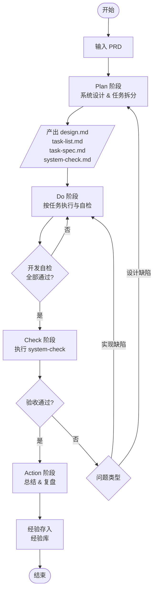
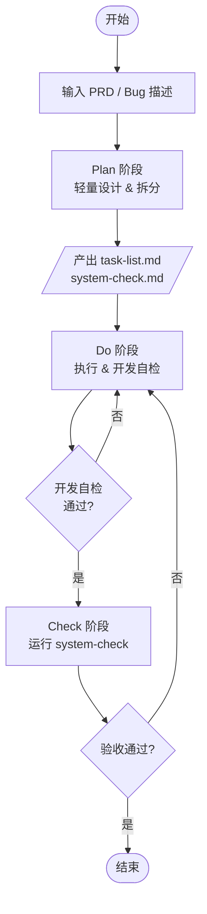

# Specification-Driven Development (SDD) 流程 v2.0

## 一、核心思想

SDD 基于 **PDCA 循环**（Plan-Do-Check-Action），以 **验收标准前置** 为原则，将需求从提出到复盘的全过程，固化为可追踪、可验证的文档流和任务流。它强调“先定义‘怎样算做完’，再动手实现”。

---

## 二、术语定义

| 术语                | 全称 / 说明                                                                                               |
| ------------------- | --------------------------------------------------------------------------------------------------------- |
| **PRD**             | Product Requirements Document，产品需求文档。可以是完整文档，也可以是“一句话需求”，是流程的**唯一输入**。 |
| **design.md**       | 系统设计概要，说明实现路径、关键决策、架构变更等。                                                        |
| **task-list.md**    | 可执行的任务清单，列出所有任务的名称、简要说明与顺序。                                                    |
| **task-spec.md**    | 单个任务的详细说明，包含：任务目标、实现步骤、**验证方式**、完成定义。                                    |
| **system-check.md** | 系统级验收清单，从用户/产品视角定义“全部做完且正确”的验收条件。                                           |
| **二次确认**        | 任务执行完成后的检查动作，分两种：**开发自检**（Do 阶段）和**验收确认**（Check 阶段）。                   |

> 原“RPD”统一成 **PRD**，避免混淆。

---

## 三、完整版流程（适用于复杂需求、中大型功能）

整个流程是一次完整的 **P-D-C-A 循环**，并在异常时回环。

### 流程图总览



### 1. Plan 阶段（计划）

**目标**：将 PRD 转化为可执行、可验收的任务体系。

**输入**：PRD（产品需求文档）。

**输出物**：

- `design.md` – 系统设计方案（架构思路、模块影响、接口变化、技术风险）。
- `task-list.md` – 有序任务列表（任务 ID + 名称 + 依赖关系）。
- `N个 task-spec.md` – 每个任务一份，必须包含 **验证方式**（单元测试、手工用例、自动化脚本等）。
- `system-check.md` – 系统验收条件清单（从用户视角定义功能表现、边界情况、性能指标等）。

**动作**：

1. 分析 PRD，完成系统设计，产出 `design.md`。
2. 将设计拆解为独立可测的任务，写入 `task-list.md`。
3. 为每个任务撰写 `task-spec.md`，明确其 **完成定义** 与 **验证方式**。
4. 提取出系统级验收条件，写入 `system-check.md`。
5. **回顾历史经验库**，检查是否有相关的坑点、检查项，补充到设计或 task-spec 中。
6. 团队评审 Plan 产出物，确认后进入 Do 阶段。

**退出条件**：所有文档评审通过，责任人明确。

---

### 2. Do 阶段（执行）

**目标**：按 spec 逐项完成实现与自检。

**动作**：

1. 按 `task-list.md` 顺序执行任务。每个任务执行时：
   - 对照 `task-spec.md` 进行编码/配置/文档。
   - **执行 task 内定义的验证方式**（跑测试、人工检查、Code Review 等），确保自检通过。
   - 在 task-list 上标记状态（如：进行中 → 自检完成）。
2. 全部任务自检完成后，执行 **开发侧二次确认**：负责人重新通览所有 task-spec，确认无遗漏、无“假完成”。
3. 确认通过后，将代码/产物提交至待验收状态，进入 Check 阶段。

**关键原则**：

- **质量内建**：不要把所有测试留到 Check 阶段。task-spec 里的验证就是小循环里的 “Check”。
- 遇到设计外的问题可在 team 内讨论，但若发现需修改 `design.md` 或 `task-list.md`，应**暂停并回退至 Plan 阶段**更新文档后再继续。

---

### 3. Check 阶段（检查）

**目标**：以用户视角验收全部功能，确保符合预期。

**动作**：

1. **验收人**（非开发者本人，可以是 QA、PM 或另一名开发）执行 `system-check.md` 上的所有验收条目。
2. 验收人核对每个 task 的完成状态（验收确认），确保与 `task-list.md` 标记一致。
3. 验收结果：
   - **全部通过** → 进入 Action 阶段。
   - **部分失败或存疑** → 记录失败项，形成问题清单，**回退至 Do 阶段**修复，严重设计偏差则回退至 Plan 阶段调整设计。
4. 回退修复后，**重新走 Check** 流程，直至全部通过。

---

### 4. Action 阶段（复盘与改进）

**目标**：总结经验，闭环 PDCA，反哺下一次 Plan。

**动作**：

1. 总结本次需求的实现情况（工期、质量、偏离度）。
2. 组织简短复盘会，讨论：
   - 哪些做得好，可以保持？
   - 哪些出现问题？是设计、执行还是验收环节的问题？
   - 有没有可提炼的规则、checklist 条目、代码模板？
3. 将经验沉淀为具体条目，存入 **团队经验库**（可附在 `design.md` 模板的“历史经验参考”部分，或独立维护 `lesson-learned.md`）。
4. 若有遗留任务或技术债，转为新的 PRD 或 backlog 条目。

**退出条件**：经验条目录入完毕，相关文档归档。

---

## 四、快速版流程（适用于 Bug 修复、简单需求）

快速版走 **P-D-C 循环**，裁剪文档以匹配轻量场景。不设 Action 复盘，但可酌情记录关键教训到源文件注释或轻量 issue 中。

### 流程总览



### 1. Plan 阶段（轻量）

**输出物**（极简）：

- **task-list.md**：步骤式任务清单（如：① 定位原因 ② 修改代码 ③ 自测），可只含一个任务。
- **system-check.md**：验收条件（Bug 修复则写“原错误场景不再复现，且相关 case 通过”；简单需求写 2~3 条功能验证点）。
- **方案说明（可选）**：如果修改稍复杂，直接在 task-list 下方加一段“方案思路”，无需单独 `design.md`。

**动作**：分析需求，写出上述文件，与相关人快速确认后进入 Do。

### 2. Do 阶段（轻量）

- 按 task-list 执行，每个步骤自验通过后标记。
- 全部完成后，开发者执行一次自检（二次确认），确保 system-check 的预期已满足。

### 3. Check 阶段（轻量）

- 由需求方或验收人运行 system-check 上的验收条目。
- **通过** → 任务结束，关闭。
- **不通过** → 记录问题，回退 Do 阶段修复，再验，直至通过。

> 快速版不要求复盘归档，但如果修 Bug 过程中发现了规避模式或重要经验，鼓励随手在团队 IM 或知识库中留下一句话经验。

---

## 五、异常处理与回退规则汇总

| 情况                                 | 触发阶段 | 回退路径                                   |
| ------------------------------------ | -------- | ------------------------------------------ |
| 任务实现中发现设计缺陷或需要新增任务 | Do       | 暂停 → 更新 Plan 文档 → 重新确认 → 继续 Do |
| Check 发现不满足 system-check        | Check    | 形成问题清单 → 退回 Do 修复                |
| Check 发现系统设计层面错误           | Check    | 退回 Plan 调整 design.md，重新拆分任务     |
| 快速版 Check 不通过                  | Check    | 退回 Do 修复                               |

---

## 六、文档模板要点

### design.md（完整版）

```markdown
# 系统设计：<需求名称>

## 背景与目标

## 方案概述

## 关键设计决策

## 接口/数据模型变更

## 影响范围

## 风险与应对

## 历史经验参考（来自经验库的 checklist）
```

### task-spec.md（完整版核心）

```markdown
# Task: <任务名> (ID: T0X)

## 目标

## 实现步骤

## 验证方式（必填）

- [ ] 单元测试：<用例描述或文件路径>
- [ ] 手工验证：<操作步骤与预期>
- [ ] Code Review 要点：<重点关注>

## 完成定义

- [ ] 代码合并至目标分支
- [ ] 所有验证通过
- [ ] 相关文档更新完成
```

### system-check.md

```markdown
# 系统验收清单：<需求名称>

## 功能验收

- [ ] 正常流程：<场景，预期>
- [ ] 异常流程：<场景，预期>

## 非功能验收（按需）

- [ ] 性能：<指标>
- [ ] 兼容性：<环境>

## 回归检查点

- [ ] 受影响旧功能是否正常
```

> 快速版可大幅精简：task-list 用 checkbox 写清步骤即可，system-check 只保留必要条目。

---

## 七、实施建议

1. **从轻到重**：先在简单需求和 Bug 上使用快速版，让团队适应“先写验收条件”的习惯，再推进完整版。
2. **文档即代码**：建议将 design.md、task-spec.md、system-check.md 与代码放在同一仓库（如 `docs/specs/` 下），版本同源，可追溯变更。
3. **模板化**：为上述文件制作团队通用模板，并结合 Action 复盘持续迭代模板内容。
4. **工具辅助**：可以用脚本将 system-check.md 转化为自动化测试框架的用例，减少手工验收成本。
5. **经验库轻量化**：经验库不必是厚重文档，可以是一个 `lessons-learned.yml` 或共享笔记，关键是要在 Plan 阶段被找到。
